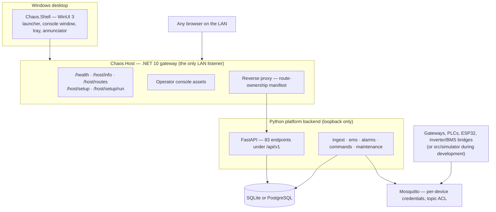

# Project CHAOS

**C**entral **H**omestead **A**utomation and **O**peration **S**ystem

A local-first operational control platform for an off-grid homestead: energy
management, water, alarms, freeze protection, an authoritative asset registry, an
MQTT telemetry pipeline, a browser operator console, and a control-room-style
alarm annunciator.

The design premise, from
[`Homestead_Digital_Twin_Software_Design_Document_v0.3.md`](Homestead_Digital_Twin_Software_Design_Document_v0.3.md):

> The homestead should be run as a small industrial site, not as a collection of
> consumer smart-home gadgets.

Three consequences run through everything here:

- **The registry owns identity.** An asset ID is never a serial number, MAC, IP
  or Home Assistant entity ID. Devices get replaced; functional positions do not.
- **The platform requests; local controllers decide.** The API can ask a pump to
  start. The PLC, the float switch and the breaker retain the authority to
  refuse. This software is not the protection system.
- **It runs without the internet, and assumes it can lose its own building.**
  The battery, the inverters and the primary server rack share one 20-foot
  container. The design assumes that container can be destroyed.

---

## What it does

| Capability | Where you use it |
|---|---|
| Asset and point registry — 90 assets, 701 points, 245 bindings | Console → **Assets** |
| Telemetry ingest, current state, historian, dead letters | Console → **Home**, **Assets** |
| Energy-management state machine, load shedding, budget leases | Console → **Energy** |
| Alarm evaluation, incident correlation, notification | Console → **Alarms** |
| Control-room annunciator panel with the ISA-18.1 sequence | Console → **Annunciator** button, or its own window |
| Dependency topology and blast-radius analysis | Console → **Topology** |
| 42U rack elevation with live device health | Console → **Rack** |
| Audited supervisory command path with eight interlocks | Console → **Control** |
| Twelve-step commissioning records and gating | Console → **Control**, and the API |
| Property map as GeoJSON | Console → **Map** |

---

## Getting it running

You need **Windows**, the **Microsoft Edge WebView2 runtime**, and the installed
product. You do **not** need Python installed — CHAOS carries its own
interpreter.

1. **Run `Chaos.Shell.exe`.** That is the whole procedure. The launcher screen
   opens, finds or starts the platform, and runs first-run setup itself.
2. **Watch the five checks** on the launcher: gateway, Windows service, platform
   executable, platform backend, first-run setup. Each is green, amber, red or
   explicitly unknown — never a calm state that has not been verified.
3. **Press "Open console".** The operator console loads inside the shell window.

The gateway also serves the same console to any browser on the LAN, at
`http://<node>:8080/`, whether or not the desktop shell is running.

Full walkthrough, including what each screen should look like:
[`docs/getting-started.md`](docs/getting-started.md).

### Building it yourself

Open [`windows/CHAOS.sln`](windows/CHAOS.sln) in **Visual Studio 2026**, set
**Chaos.Shell** as the startup project, and press **F5**. Tests are in **Test
Explorer**. See [`docs/visual-studio.md`](docs/visual-studio.md) — including the
one thing that is not automatic yet (the gateway does not currently start the
Python backend for you).

---

## Architecture in one screen



The gateway listens on `0.0.0.0:8080`. The Python backend listens on
`127.0.0.1:8081` and is never exposed to the LAN — it is an unauthenticated
control API, and it is reached through the gateway or not at all.

Two nodes run this stack: the **primary** in the power container, and a
**secondary control node** in a separate structure that observes, alerts and
holds a replica — and deliberately cannot issue commands. See
[`docs/secondary-control-node.md`](docs/secondary-control-node.md).

Full treatment: [`docs/architecture.md`](docs/architecture.md).

---

## Where to go next

Start with [`docs/index.md`](docs/index.md) — it carries the reading order, a
task-oriented "how do I…" index, and the full document set.

| If you are… | Read |
|---|---|
| Installing or running it for the first time | [Getting started](docs/getting-started.md) |
| Building or debugging it | [Building in Visual Studio 2026](docs/visual-studio.md) |
| Learning the operator surfaces | [The desktop shell](docs/desktop-shell.md), [The operator console](docs/operator-console.md), [The annunciator panel](docs/annunciator.md) |
| Working out why something is broken | [Troubleshooting](docs/troubleshooting.md) |
| Preparing to control real equipment | [Commissioning](docs/commissioning.md), [Control](docs/control.md) |
| Working on a headless node, unattended install or remote session | [Command line](docs/advanced-command-line.md), [Container deployment](docs/advanced-container-deployment.md) |

---

## Repository layout

```text
Homestead_Digital_Twin_Software_Design_Document_v0.3.md   the design document
data/            machine-readable design package (YAML), validated in CI
schemas/         JSON Schema Draft 2020-12 for each data document
tools/           validate_bundle.py — schema and cross-reference validation

src/chaos/       the Python platform backend
  config.py      every CHAOS_* setting
  models/        SQLAlchemy: registry, telemetry, energy, alarms, commands, maintenance
  topics.py      MQTT topic conventions      envelope.py  telemetry/command envelopes
  mqtt.py        MessageBus: PahoBus (real) and InMemoryBus (tests, bench)
  runtime.py     background-service lifecycle, node-role selection
  registry/      design-package loader       ingest/    resolve, historian, dead-letter
  ems/           energy state machine        alarms/    evaluate, correlate, notify
  commands/      interlocks, modes, audit    maintenance/ plans, work orders, commissioning
  api/           FastAPI app and routers     web/       the operator console and annunciator
  cli.py         the chaos CLI (advanced; see docs/advanced-command-line.md)

src/simulator/   simulated site: solar, battery, inverter, generator, loads, weather

windows/
  CHAOS.sln                 open this in Visual Studio 2026
  src/Chaos.Host/           the .NET gateway — LAN listener, proxy, first-run setup
  src/Chaos.Host.Supervisor/ supervises the Python backend as a child process
  src/Chaos.Api/            subsystems ported from Python to .NET (none live yet)
  src/Chaos.Shell/          the WinUI 3 desktop shell (Windows only)
  src/Chaos.Shell.Core/     the shell's testable half — runs everywhere
  tests/                    five xUnit projects
  build/                    PowerShell build and packaging scripts (advanced)
  installer/                installer configuration

deploy/          Docker Compose stacks for headless nodes (advanced)
docs/            this documentation set — start at docs/index.md
tests/           2062 pytest tests, all against SQLite and the in-memory bus
```

---

## Current status

### Working, and exercised against the simulator

Registry and design-package loading · telemetry ingest with dead-lettering ·
current-state cache · relational historian and retention · EMS state machine,
shedding, restoration, generator coordination, black start, budget leases ·
alarm definitions, evaluation, correlation, log notification · command path with
eight interlocks, operating modes and audit · maintenance and commissioning
records · annunciator panel · topology and blast-radius analysis · rack
elevation · 83 REST endpoints · the .NET gateway with first-run setup · the
WinUI 3 desktop shell · 2062 passing Python tests.

### Partial or stubbed

- **The gateway does not start the Python backend yet.** `Chaos.Host` is built
  to supervise it and ships the supervisor, but its entry point registers the
  no-op supervisor, so the backend must be started separately. `/host/info`
  reports `supervisor.registered: false` when this is the case.
- **Notification backends** — `log` is wired. `email`, `push` and `voice` are
  named but not implemented. A log line is not an alert.
- **Historian** is a relational table. The InfluxDB-versus-TimescaleDB decision
  is unresolved, so neither is deployed.
- **PostGIS** geometry column is prepared but disabled; geometry is stored as
  GeoJSON.
- **MQTT TLS** is configured and deliberately left disabled rather than
  half-configured.
- **No schema migrations.** `init-db` adds tables; it never alters them.
- **Prometheus** scrapes only itself. The API exposes no `/metrics`.

### Not built

Home Assistant integration · Node-RED flows · property-map rendering on a real
map · Level 4 forecasting and scenario simulation · subsystem coordinators for
water, irrigation, greenhouse, compost, nitrogen storage, spa and security ·
SNMP/Modbus polling of real devices · camera and NVR integration · voice
escalation · the document library.

### The headline

**No part of this platform has been connected to real plant.** Every control
path has been exercised against the simulator and the in-memory bus, which is
step 1 of the twelve-step commissioning sequence and nothing beyond it. Closing
that gap is what [`docs/commissioning.md`](docs/commissioning.md) is for, one
subsystem at a time.

---

## License

Apache-2.0. See [`LICENSE`](LICENSE). Attribution for borrowed design ideas is
in [`ACKNOWLEDGEMENTS.md`](ACKNOWLEDGEMENTS.md).
