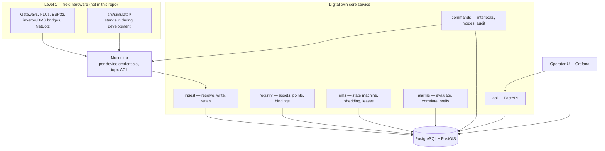

# Project CHAOS

**C**entral **H**omestead **A**utomation and **O**peration **S**ystem

A local-first operational control plane for an off-grid homestead: an
authoritative asset and point registry, telemetry ingest, an energy-management
state machine, an alarm engine, an audited supervisory command path, and the API
and dashboards on top of them.

The design premise, from
[`Homestead_Digital_Twin_Software_Design_Document_v0.3.md`](Homestead_Digital_Twin_Software_Design_Document_v0.3.md):

> The homestead should be run as a small industrial site, not as a collection of
> consumer smart-home gadgets.

Three consequences run through everything here:

- **The registry owns identity.** An asset ID is never a serial number, MAC, IP
  or Home Assistant entity ID. Devices get replaced; functional positions do not.
- **The platform requests; local controllers decide.** The API can ask a pump to
  start. The PLC, the float switch and the breaker retain the authority to refuse.
  This software is not the protection system.
- **It runs without the internet, and assumes it can lose its own building.**
  The battery, the inverters and the primary server rack share one 20-foot
  container. The design assumes that container can be destroyed.

---

## Quickstart

Nothing external required — SQLite and an in-process message bus.

```sh
git clone <repo> && cd chaos
python3 -m venv .venv && . .venv/bin/activate
make install            # pip install -e ".[dev]"

make validate           # design package vs. its JSON Schemas
make init-db            # create tables
make load               # registry + load schedule + alarm definitions
make status             # what actually landed
make run                # http://127.0.0.1:8000
```

Open <http://127.0.0.1:8000> for the operator UI, or `/docs` for the API.

Give it something to look at, in a second terminal:

```sh
make simulate ARGS="--list-scenarios"
make simulate ARGS="--scenario <name> --offline"
```

`make status` after a load should report something like:

```
Homestead Digital Twin 0.4.0
  node role        : primary
  physical control : disabled

Registry and history
  assets                 90
  points                 701
  point_bindings         245
  power_load_profiles    12
  alarm_definitions      40
```

`physical control : disabled` is correct and should stay that way until a
subsystem has passed commissioning. See [`docs/commissioning.md`](docs/commissioning.md).

---

## Architecture in one screen



Two nodes run this stack (SDD 16.1): the **primary** in the power container, and
a **secondary control node** in a separate structure that observes, alerts and
holds a replica — and deliberately cannot issue commands.

Full mapping onto the design document, including what is stubbed and what is not
built: [`docs/architecture.md`](docs/architecture.md).

---

## Repository layout

```
Homestead_Digital_Twin_Software_Design_Document_v0.3.md   the design document
data/            machine-readable design package (YAML + JSON mirrors)
schemas/         JSON Schema Draft 2020-12 for each data document
tools/           validate_bundle.py — schema and cross-reference validation

src/chaos/
  config.py      every CHAOS_* setting
  db.py          engine, sessions, create_all
  models/        SQLAlchemy: registry, telemetry, energy, alarms, commands, maintenance
  topics.py      MQTT topic conventions (SDD 10.1, 26.2)
  envelope.py    telemetry / command / ack envelopes (SDD 10.2, 10.3)
  mqtt.py        MessageBus: PahoBus (real) and InMemoryBus (tests, bench)
  runtime.py     background-service lifecycle, node-role selection
  registry/      design-package loader
  ingest/        topic resolution, historian writes, dead-lettering, retention
  ems/           energy state machine, shedding, leases, generator, black start
  alarms/        definitions, evaluator, correlation, notification
  commands/      command manager, interlocks, operating modes
  maintenance/   plans, work orders, commissioning records
  api/           FastAPI app and routers
  web/           built-in operator UI
  cli.py         chaos

src/simulator/   simulated site: solar, battery, inverter, generator, loads, weather

deploy/          Dockerfile, compose (primary + secondary), Mosquitto, Postgres,
                 Grafana, Prometheus, backup script
docs/            architecture, deployment, operations, commissioning, api,
                 network and trust boundaries, secondary control node
tests/           pytest, all against SQLite and the in-memory bus
```

---

## The design package and the code

`data/` is not documentation. It is the **input** the registry is built from, and
it is validated in CI before anything loads it.

| File | Contents |
|---|---|
| `asset_class_dictionary.yaml` | Domains, relationship types, lifecycle vocabularies, asset classes, point profiles |
| `point_dictionary.yaml` | Canonical point names, classes, types, units, provenance |
| `homestead_asset_register.yaml` | 90 assets: site, container, PV, inverters, battery, rack, network, services, sensors, load groups |
| `point_bindings.yaml` | Vendor/protocol bindings — addresses are `TBD` unless the source supplied them |
| `load_schedule.yaml` | EMS load records with tier, control method and restoration policy |
| `alarm_definitions.yaml` | 40 alarm definitions with severity and operating context |
| `water_assets.yaml`, `water_points.yaml`, `rack_layout.yaml`, `asset_lifecycle.yaml` | Later design-package passes |

```
data/*.yaml  ──validate──▶  schemas/*.schema.json
     │
     └──chaos load-all──▶  PostgreSQL registry  ──▶  API, EMS, alarms, UI
```

The package deliberately **does not invent** IP addresses, MAC addresses, serial
numbers, breaker numbers, wire sizes, Modbus registers, SNMP OIDs or exact
ratings. Those appear as `open_fields` on each asset. The documentation in
`docs/` follows the same rule: where the design package says TBD, the docs say
open item, not a plausible guess.

Where the design contradicts itself — most importantly the 12 kW / 40 kWh versus
45 kWdc / 800 kWh energy design (SDD 30.2) — the register preserves both, and
`GET /api/v1/registry/design-conflicts` surfaces them.

---

## CLI

`chaos` is the operator interface on a node with no browser. Subsystems
import lazily, so it keeps working on a partially deployed node.

| Command | Purpose |
|---|---|
| `init-db` | Create every table |
| `load-registry` | Load the design package into the registry |
| `load-all` | Registry + load schedule + alarm definitions |
| `validate` | Validate the design package against its schemas |
| `serve` | Run the API |
| `simulate ...` | Delegate to the simulator |
| `retention --apply/--dry-run` | Data retention (SDD 16.4) |
| `backup --output` | Portable registry + config archive (SDD 16.1 mitigation 3) |
| `status [--json]` | Node role, database, counts, EMS state, active alarms |
| `export --format json\|yaml` | Open-format export (FR-010) |

Exit codes: `0` success, `1` failure, `2` usage error, `3` subsystem unavailable.

```sh
chaos status --json | jq .active_alarms
chaos export --include registry,alarms --format yaml -o registry.yaml
chaos backup --output /mnt/offsite/
```

---

## Testing

```sh
make test           # pytest
make lint           # ruff
make ci             # validate + lint + test
```

Everything runs against SQLite and the in-memory bus: no PostgreSQL, no broker,
no hardware. That is deliberate — it is SDD section 19 step 1, bench test, and it
means the platform is exercisable end to end from a laptop.

CI additionally validates both compose files, parses the Grafana and Prometheus
configuration, builds the container image, runs the CLI inside it, and asserts
the container is non-root and reaches `healthy`.

---

## Deployment

```sh
cp deploy/.env.example deploy/.env    # replace every CHANGE_ME
make up                               # primary node stack
make secondary-up                     # secondary control node
```

Full procedure, including broker credentials and the safety gate:
[`docs/deployment.md`](docs/deployment.md).

---

## Documentation

| Document | Covers |
|---|---|
| [`docs/architecture.md`](docs/architecture.md) | Mapping onto SDD 6, 7, 8. What is implemented, stubbed, and not built |
| [`docs/deployment.md`](docs/deployment.md) | Local development, both node stacks, image, upgrades, troubleshooting |
| [`docs/operations.md`](docs/operations.md) | Runbooks: black start, comms loss, alarm floods, backup/restore, retention |
| [`docs/commissioning.md`](docs/commissioning.md) | The SDD 19 twelve-step sequence as a checklist tied to platform records |
| [`docs/api.md`](docs/api.md) | Endpoint reference, roles, error semantics |
| [`docs/network-and-trust-boundaries.md`](docs/network-and-trust-boundaries.md) | SDD 49 item 3: VLANs, trust boundaries, firewall flows, service identities |
| [`docs/secondary-control-node.md`](docs/secondary-control-node.md) | SDD 49 item 6: what survives loss of the power container |
| [`docs/design-decisions/`](docs/design-decisions/) | The SDD section 22 open decisions, made decidable. All still *proposed* |
| [`docs/water-control-narrative.md`](docs/water-control-narrative.md) | Water-system control narrative (SDD 49 item 5) |
| [`deploy/mosquitto/README.md`](deploy/mosquitto/README.md) | Per-device credentials and topic-prefix ACLs |

---

## Current status

### Implemented, tested against the simulator

Registry and design-package loading · telemetry ingest with dead-lettering ·
current-state cache · relational historian and retention · EMS state machine,
shedding, restoration, generator coordination, black start, budget leases ·
alarm definitions, evaluation, correlation, log notification · command path with
interlocks, operating modes and audit · maintenance and commissioning records ·
80 REST endpoints · built-in operator UI · CLI · Docker deployment for both node
roles · Grafana dashboards over real tables.

### Stubbed or partial

- **Prometheus** scrapes only itself. No exporters are deployed, and most target
  addresses are open items. The API exposes no `/metrics`.
- **Notification backends** — `log` is wired. `email`, `push` and `voice` (CUCM)
  are named but check `alarms/notify.py` before relying on one.
- **Historian** is a relational table in PostgreSQL. InfluxDB versus TimescaleDB
  (SDD open decision 22.3) is unresolved, so neither is deployed.
- **PostGIS** is installed and the geometry column is prepared, but geometry is
  stored as GeoJSON and the generated column is commented out.
- **MQTT TLS** — the listener is configured and deliberately left disabled rather
  than half-configured.
- **No schema migrations.** `create_all` adds tables; it never alters them.
  Alembic is declared and unused.

### Not built

Home Assistant integration · Node-RED flows · property-map rendering (MapLibre) ·
wall-display views · Level 4 forecasting, prediction and scenario simulation ·
subsystem coordinators for water, irrigation, greenhouse, compost, nitrogen
storage, spa and security · SNMP/Modbus polling of real devices · camera and NVR
integration · voice escalation · automated network-device configuration backup ·
NTP service and holdover · the ZFS document library.

### The headline

**No part of this platform has been connected to real plant.** Every control path
has been exercised against the simulator and the in-memory bus, which is SDD
section 19 step 1 and nothing beyond it.

Consequently, most of the SDD section 21 MVP acceptance criteria are outstanding:

| # | Criterion | Status |
|---:|---|---|
| 1 | Registry contains all installed core assets | **Met for what is designed** — 90 assets, though most are `planned`, not installed |
| 2 | Live energy, water, rack, weather and alarm state | **Not met** — needs hardware |
| 3 | MQTT telemetry follows one documented schema | **Met** — `topics.py`, `envelope.py` |
| 4 | Critical alarms work during internet loss | **Not met** — `log` is not an alert |
| 5 | HA, Node-RED, Grafana and the API backed up automatically | **Partial** — Grafana and the API yes; HA and Node-RED do not exist |
| 6 | One physical subsystem controlled with acknowledgement and audit | **Not met** — needs hardware |
| 7 | Communications-loss and server-loss tests | **Not met** against hardware; simulated only |
| 8 | Property map displays structures and assets | **Not met** — GeoJSON is served, nothing renders it |
| 9 | Every critical asset has a manual override and failure-state record | **Partial** — the schema requires it; the data is incomplete |
| 10 | Data export and restore tested | **Partial** — export works and is tested; restore is documented, not drilled |

Closing these is what `docs/commissioning.md` is for, one subsystem at a time,
starting with SDD Phase B.

---

## License

Apache-2.0. See [`LICENSE`](LICENSE).
