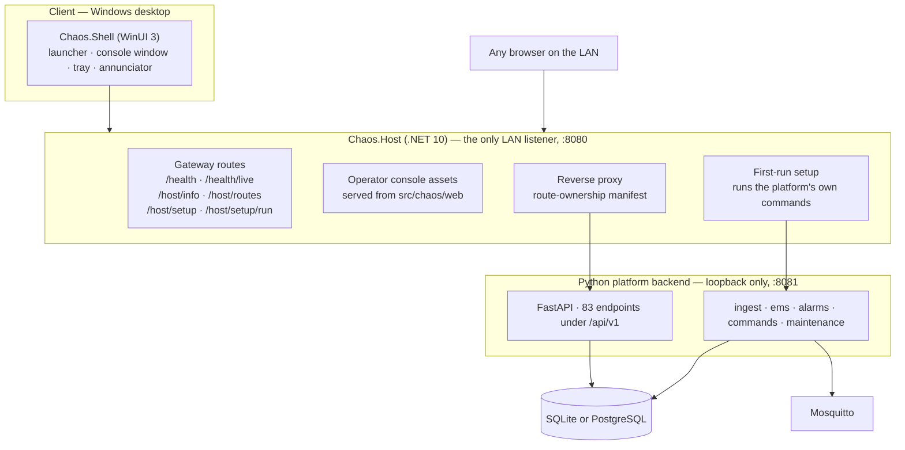
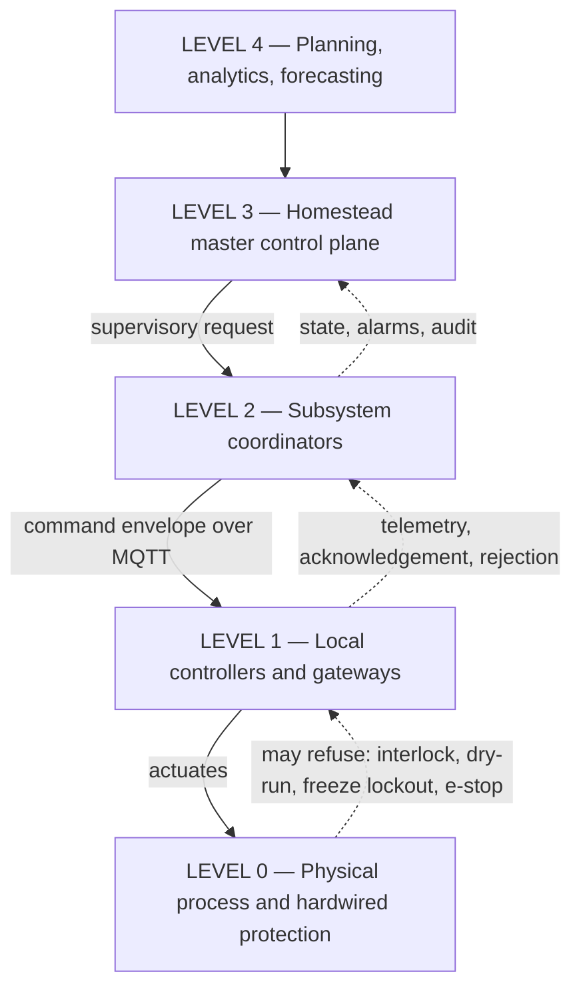

# Architecture

How Project CHAOS is put together, why it is split the way it is, and — just as
important — what it does not yet do.

Related: [Building in Visual Studio 2026](./visual-studio.md) ·
[The desktop shell](./desktop-shell.md) ·
[Control](./control.md) ·
[Secondary control node](./secondary-control-node.md)

---

## 1. What this software is

A local-first operational control plane for an off-grid homestead: an
authoritative asset and point registry, a telemetry ingest path, a supervisory
command path with audit, an energy-management state machine, an alarm engine,
and the interfaces on top of them.

Three properties shape every decision below.

**The registry owns identity.** An asset ID is never derived from a vendor
serial, MAC, IP or home-automation entity ID. Devices get replaced; the
functional position does not. Vendor facts live in external identifiers and
point bindings, both of which are expected to churn.

**The platform requests; local controllers decide.** The API can ask a pump to
start. The PLC, the BMS, the float switch and the breaker retain the authority
to refuse. Nothing here bypasses that, and **the software is not the protection
system**.

**It runs without the internet, and it must survive losing its own building.**
The design assumes the combined battery and server container can be destroyed.
That assumption is why SQLite is a supported backend, why the command line
remains a first-class interface for a headless node, and why
[Secondary control node](./secondary-control-node.md) exists.

---

## 2. The three processes



| Process | Language | Listens on | Job |
|---|---|---|---|
| `Chaos.Shell` | C# / WinUI 3 | nothing | The Windows front end. A client |
| `Chaos.Host` | C# / .NET 10 | `0.0.0.0:8080` | The front door: the only LAN listener, the console's web server, the reverse proxy, and first-run setup |
| The platform backend | Python 3.11 / FastAPI | `127.0.0.1:8081` | Everything that decides anything |

### Why the backend is on loopback

**It is an unauthenticated control API.** Authentication terminates upstream at a
VPN or reverse proxy; the backend only records *who* an action was taken by. So
it is reached through the gateway or not at all, and the gateway refuses a
non-loopback backend address unless that is explicitly configured.

### Why there is a gateway at all

Four reasons, in the order they mattered:

1. **One listener.** A single place where LAN exposure, timeouts, forwarded
   headers and the firewall rule are decided.
2. **First-run setup.** Launching the executable has to be the whole
   installation procedure, and something has to look at the database and act.
3. **A migration seam.** Subsystems can be ported from Python to .NET one route
   prefix at a time, with the live answer to "who serves what" available on
   `/host/routes`.
4. **Honest health.** The gateway answers `/health` even when the backend is
   dead, which is the case it exists for.

### Route ownership

Every request is matched against a manifest: longest prefix wins, at segment
boundaries. Today **every `/api/v1` prefix is Python.** `/health` and `/host`
are the only .NET-owned rows.

Two rules keep it safe:

- The `/api/v1` row is a deliberate catch-all, so a new Python endpoint nobody
  listed still proxies instead of 404-ing.
- **The host refuses to start** if a row claims a prefix for .NET and no .NET
  endpoint is registered under it. A route marked as ported with nothing behind
  it answers 404, and a 404 from an alarm endpoint reads like *"no alarms"*.

`Chaos.Api` exists as the destination for ported subsystems, is built and
tested, and **is not wired into the gateway today**.

### Health, and what each answer means

| Endpoint | Answers |
|---|---|
| `/health/live` | 200 whenever this gateway process is running. Says nothing about the platform |
| `/health` | 200 **only** when the backend is up; 503 when it is down or starting, with the full body either way |
| `/host/info` | Identity, addresses, web-root resolution, supervisor state, route counts |
| `/host/routes` | The live route-ownership table |
| `/host/setup` | Always 200 — a report that a machine needs setting up is a successful report |

A gateway that returned 200 while the platform behind it was dead would tell
every status-code-only monitor that an off-grid site with no alarm engine is
fine. And a gateway reporting healthy over a platform with **no database** is
the same lie in a different costume, so a setup state of `failed` or
`needs_attention` forces `degraded` whatever the backend says.

### Process supervision

`Chaos.Host.Supervisor` resolves which Python runs the platform — the embedded
runtime when one is installed, otherwise a development interpreter — launches it
on loopback, and gates readiness on its `/health` answering rather than on the
process having started. It restarts with backoff behind a circuit breaker, so a
crash loop reports a terminal failure instead of looking like "starting"
forever. The gateway registers it at composition and `/host/info` reports its
state.

`CHAOS_SuperviseBackend=false` turns it off on a node where the backend is
started by something else; proxying, health reporting and first-run setup work
either way. See
[Visual Studio § What happens when you press F5](./visual-studio.md#what-happens-when-you-press-f5).

---

## 3. Control hierarchy



| Level | Scope | In this repository | Status |
|---|---|---|---|
| 4 | Long-term models, forecasting, scenario simulation, budget linkage | The maintenance scheduler produces due-work forecasts. Nothing else | **Not built** |
| 3 | Registry, event engine, supervisory rules, dashboards, command service, alerts, work orders | `registry/`, `commands/`, `alarms/`, `maintenance/`, `api/`, `web/` | **Implemented** |
| 2 | Energy, irrigation, greenhouse, water plant, container environment, security, spa | `ems/` only | **Energy implemented; every other coordinator not built** |
| 1 | PLCs, inverter/BMS controls, ESP32 nodes, long-range radio, relays, environmental monitors | Out of scope — real hardware. `src/simulator/` stands in during development | **Simulated only** |
| 0 | Breakers, fuses, relief valves, float switches, e-stops | Physical. Deliberately not represented as controllable software | **N/A by design** |

**The most important row is Level 1.** Nothing in this repository has ever
talked to a real inverter, pump or PLC.

---

## 4. The subsystems

### Registry

Reads the four design-package documents and upserts them, recording a
configuration revision for the load. It is idempotent and additive, and it is
the only writer of dictionary-derived rows.

The separation that matters is enforced in the schema: asset identity, point
identity, and vendor binding are three different things. A binding stays `tbd`
until commissioning verifies the real address — which is why the binding-status
breakdown is the honest measure of how much of the property is wired up rather
than merely modelled.

See [The design package](./design-package.md).

### Ingest

```text
bus message → topic resolver → telemetry writer → current state + historian
```

Two rules:

- **The registry resolves topic to point**, never string parsing. A topic
  segment of the form `<class>_<instance>` cannot be split unambiguously, so it
  is not attempted.
- **Nothing is dropped silently.** Anything unresolvable becomes a dead letter
  with a reason, because a silently discarded message during commissioning looks
  exactly like a dead sensor.

### Energy management

A ten-state machine, load-tier shedding, restoration, generator coordination,
black-start sequencing and power-budget leases.

The energy manager publishes a state and grants budgets; **it is not a universal
relay board.** There is exactly one on the property, and the platform refuses to
start it on a secondary node.

The authoritative energy design is still an open conflict — a 12 kW / 40 kWh
baseline versus a 45 kWdc / 800 kWh revision. The register preserves both, and
**no threshold in the energy manager assumes either is correct.**

### Alarms

Definitions load from the design package. The evaluator runs against current
state; correlation groups related alarms into incidents so one power-container
outage does not produce hundreds of independent notifications. See
[Alarms](./alarms.md).

### Commands

Interlock evaluation → audit record → dispatch → acknowledgement or expiry.
Every command carries who, why, under which operating mode, an idempotency key
and a time to live. See [Control](./control.md).

### Maintenance

Plans, due-work generation, work orders, inspections, calibrations, spare parts,
and the twelve-step commissioning record — which turns the sequence into
something the platform **enforces** rather than something a document asks for.
See [Commissioning](./commissioning.md).

### The operator console

`src/chaos/web/` — vanilla ES modules, no framework, no build step, no network
dependency beyond the server it came from. Served by the gateway. See
[The operator console](./operator-console.md).

### The simulator

A simulated site — solar, battery, inverter, generator, loads, rack, weather —
publishing real envelopes on real topics, to a real broker or to the in-process
bus. This is how every control path in this repository has been exercised.

---

## 5. Runtime shape

Background services are selected by node role and settings:

| Service | Runs when | Notes |
|---|---|---|
| Ingest | The bus is enabled | |
| Command dispatch | The bus is enabled | **Not suppressed on a secondary node** — see below |
| Alarm engine | The alarm engine is enabled | |
| Energy manager | Enabled **and** not a secondary node | The only role-based suppression in the platform |

**One subsystem failing to start never prevents the others**: a frozen
greenhouse is worse than a missing dashboard. The same rule governs the gateway:
a background service that throws must not take the host down, because the
gateway's job during a failure is to stay up and report it.

**Worth knowing:** role is enforced for the energy manager only. On a secondary
node the command-dispatch service is still registered whenever the bus is
enabled, so the physical-control gate is the thing standing between the
secondary node and a second source of commands — backed by broker permissions.
[Secondary control node § How that is enforced](./secondary-control-node.md#how-that-is-enforced)
explains why that is treated as a primary control rather than belt-and-braces.

---

## 6. Storage

| Concern | Today |
|---|---|
| Database | SQLite by default; PostgreSQL supported |
| Historian | A relational table. The InfluxDB-versus-TimescaleDB decision is unresolved, so neither is deployed |
| Geospatial | PostGIS is installed and the geometry column prepared, but geometry is stored as GeoJSON and the generated column is commented out |
| Migrations | **None.** Table creation adds tables; it never alters them |

The relational historian is a real limitation, not a finished choice. It is
adequate for commissioning and for the secondary node; it is not adequate for
years of high-resolution telemetry. The per-point series key and retention
policy are kept in the registry precisely so the historian can be swapped
**without touching point identity**.

---

## 7. Deployment shapes

| Shape | What it is | Documented in |
|---|---|---|
| **The Windows product** | Installer, gateway as a Windows service, desktop shell, embedded Python runtime | [Getting started](./getting-started.md) |
| **The container stack** | Docker Compose for a primary node and a headless secondary node | [Container deployment](./advanced-container-deployment.md) |
| **A development checkout** | Visual Studio for the .NET half; the platform on SQLite and an in-memory bus | [Building in Visual Studio 2026](./visual-studio.md) |

All three run the same platform code. The container stack additionally deploys
PostgreSQL, Mosquitto, Prometheus and Grafana.

---

## 8. Status summary

### Implemented, and exercised against the simulator

Registry and design-package loading · telemetry ingest with dead-lettering ·
current-state cache · relational historian and retention · energy state machine,
shedding, restoration, generator coordination, black start, budget leases ·
alarm definitions, evaluation, correlation, log notification · command path with
eight interlocks, operating modes and audit · maintenance and commissioning
records · annunciator panel · topology and blast-radius analysis · rack
elevation · 83 REST endpoints under `/api/v1` · the operator console · the .NET
gateway with route ownership and first-run setup · the WinUI 3 desktop shell ·
the command line · container deployment for both node roles · Grafana dashboards
over real tables · 2128 Python tests.

### Stubbed or partial

| Thing | State |
|---|---|
| **Backend process supervision** | The supervisor is built and shipped; the gateway's entry point does not register it |
| **Ported .NET subsystems** | `Chaos.Api` is built and tested; no route is owned by it |
| **Notification backends** | Only `log` is implemented. `email`, `push` and `voice` record `not_configured` and never claim success |
| **Prometheus** | Scrapes only itself. No exporters deployed, most target addresses are open items. The API exposes no `/metrics` |
| **Historian** | Relational, pending the InfluxDB/TimescaleDB decision |
| **PostGIS** | Geometry column prepared and disabled; GeoJSON stored |
| **MQTT TLS** | Configured and deliberately left disabled rather than half-configured |
| **Migrations** | None. Alembic is declared and unused |
| **Water, rack and lifecycle extensions** | In the design package; not merged into the registry. Consumed directly by the screens that need them |

### Not built

Home Assistant integration · Node-RED flows · property-map rendering on a real
map · dedicated wall-display views beyond the console's wall mode · Level 4
forecasting, prediction and scenario simulation · subsystem coordinators for
water, irrigation, greenhouse, compost, nitrogen storage, spa and security ·
SNMP/Modbus polling of real devices · camera and NVR integration · voice
escalation · automated network-device configuration backup · a time service with
holdover · the document library.

### The headline

**No part of this platform has been connected to real plant.** Every control
path has been exercised against the simulator and the in-memory bus, which is
the bench-test commissioning step and nothing beyond it.

Consequently most of the MVP acceptance criteria are outstanding:

| # | Criterion | Status |
|---:|---|---|
| 1 | Registry contains all installed core assets | **Met for what is designed** — 90 assets, though most are `planned`, not installed |
| 2 | Live energy, water, rack, weather and alarm state | **Not met** — needs hardware |
| 3 | Telemetry follows one documented schema | **Met** |
| 4 | Critical alarms work during internet loss | **Not met** — a log line is not an alert |
| 5 | Home automation, flows, dashboards and the API backed up automatically | **Partial** — dashboards and the API yes; the others do not exist |
| 6 | One physical subsystem controlled with acknowledgement and audit | **Not met** — needs hardware |
| 7 | Communications-loss and server-loss tests | **Not met** against hardware; simulated only |
| 8 | Property map displays structures and assets | **Not met** — GeoJSON is served, nothing renders it over a basemap |
| 9 | Every critical asset has a manual override and failure-state record | **Partial** — the schema requires it; the data is incomplete |
| 10 | Data export and restore tested | **Partial** — export works and is tested; restore is documented, not drilled |

Closing these is what [Commissioning](./commissioning.md) is for, one subsystem
at a time.

---

## 9. Related reading

| Document | Why |
|---|---|
| [The design package](./design-package.md) | What the registry is built from |
| [Control](./control.md) | The command path in detail |
| [Alarms](./alarms.md) | The alarm engine in detail |
| [Secondary control node](./secondary-control-node.md) | The second deployment, and why it must not take over |
| [Integration findings](./integration-findings.md) | What running all of this end to end revealed |
| [API reference](./api.md) | Every endpoint |
