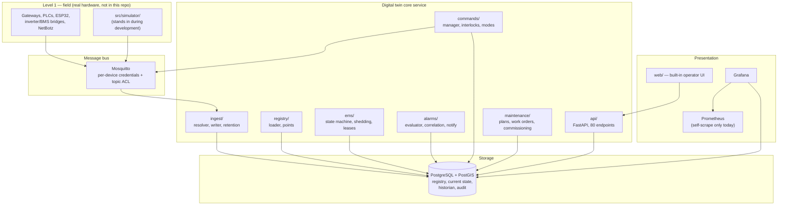

# Architecture

How the code in this repository maps onto the design document, and — just as
important — what it does not yet do.

Reference: `Homestead_Digital_Twin_Software_Design_Document_v0.3.md`, sections
6 (control hierarchy), 7 (logical architecture) and 8 (software components).

---

## 1. What this software is

A local-first operational control plane for an off-grid homestead: an
authoritative asset and point registry, a telemetry ingest path, a supervisory
command path with audit, an energy-management state machine, an alarm engine,
and the API and dashboards on top of them.

Three properties shape every design decision below.

**The registry owns identity.** An asset ID is never derived from a vendor
serial, MAC, IP or Home Assistant entity ID (SDD 25.3 rule 7). Devices get
replaced; the functional position does not. Vendor facts live in
`external_identifiers` and `point_bindings`, both of which are expected to churn.

**The platform requests; local controllers decide.** The API can ask a pump to
start. The PLC, the BMS, the float switch and the breaker retain the authority
to refuse (SDD 6). Nothing here bypasses that, and the software is not the
protection system.

**It runs without the internet, and it must survive losing its own building.**
The design assumes the combined battery and server container can be destroyed
(SDD 16.1). That assumption is why SQLite is a supported backend, why the CLI
is a first-class interface, and why `docs/secondary-control-node.md` exists.

---

## 2. Control hierarchy (SDD section 6)

```mermaid
flowchart TB
  L4["LEVEL 4 — Planning, analytics, forecasting"]
  L3["LEVEL 3 — Homestead master control plane"]
  L2["LEVEL 2 — Subsystem coordinators"]
  L1["LEVEL 1 — Local controllers and gateways"]
  L0["LEVEL 0 — Physical process and hardwired protection"]

  L4 --> L3
  L3 -->|"supervisory request"| L2
  L2 -->|"command envelope over MQTT"| L1
  L1 -->|"actuates"| L0
  L0 -.->|"may refuse: interlock, dry-run, freeze lockout, e-stop"| L1
  L1 -.->|"telemetry, acknowledgement, rejection"| L2
  L2 -.->|"state, alarms, audit"| L3
```

| Level | SDD scope | In this repository | Status |
|---|---|---|---|
| 4 | Long-term models, forecasting, scenario simulation, budget linkage | `maintenance/scheduler.py` produces due-work forecasts. Nothing else. | **Not built** (SDD Phase E) |
| 3 | Registry, event engine, supervisory rules, dashboards, command service, alerts, work orders | `registry/`, `commands/`, `alarms/`, `maintenance/`, `api/`, `web/` | **Implemented** |
| 2 | Energy, irrigation, greenhouse, water plant, container environment, security, spa | `ems/` only | **Energy implemented; every other coordinator not built** |
| 1 | PLCs, inverter/BMS controls, ESP32 nodes, LoRaWAN, relays, NetBotz | Out of scope — real hardware. `src/simulator/` stands in for it during development. | **Simulated only** |
| 0 | Breakers, fuses, relief valves, float switches, e-stops | Physical. Deliberately not represented as controllable software. | **N/A by design** |

The most important row is Level 1. Nothing in this repository has ever talked to
a real inverter, pump or PLC. Every control path has been exercised against the
simulator and the in-memory bus, which is exactly the state SDD section 19 step 1
("bench test") describes, and no further.

---

## 3. Logical architecture (SDD section 7)

Compare with SDD section 7: **Home Assistant and Node-RED are absent**, and the
time-series database is PostgreSQL rather than InfluxDB or TimescaleDB. Both are
covered in section 5 below.

---

## 4. Software components (SDD section 8)

### 8.1 Digital Twin Core Service — implemented

Python 3.11, FastAPI, SQLAlchemy 2.0, PostgreSQL + PostGIS (SQLite supported).

| Responsibility (SDD 8.1) | Where | Status |
|---|---|---|
| Asset registry | `models/registry.py`, `registry/loader.py` | Implemented — 90 assets, 701 points, 245 bindings load from the design package |
| Property and geospatial hierarchy | `models/registry.py` `Location`, `/api/v1/overview/map` | Implemented as GeoJSON; PostGIS geometry column prepared but not enabled (`deploy/postgres/init.sql`) |
| Device-to-asset mapping | `models/registry.py` `PointBinding`, `ExternalIdentifier` | Implemented |
| Point definitions and units | `models/registry.py` `PointDefinition`, `registry/points.py` | Implemented |
| Relationships and dependencies | `AssetRelationship` | Implemented |
| State aggregation | `models/telemetry.py` `CurrentState`, `api/routers/overview.py` | Implemented |
| Command authorization and audit | `commands/` , `models/commands.py` | Implemented; **never exercised against real plant** |
| Maintenance and inspection records | `maintenance/`, `models/maintenance.py` | Implemented |
| Document/manual references | `models/registry.py` `Document` | Table exists; no document library behind it |
| Configuration revisions | `ConfigurationRevision` | Implemented |
| API for dashboards | `api/` | Implemented |

### 8.2 MQTT broker — implemented

Eclipse Mosquitto via `deploy/docker-compose.yml`. `homestead_twin/mqtt.py`
provides two interchangeable implementations behind one `MessageBus` protocol:
`PahoBus` for real brokers, `InMemoryBus` for tests, the simulator's offline
mode and bench testing.

Against the SDD 8.2 baseline: per-device credentials ✅, topic-prefix ACLs ✅
(`deploy/mosquitto/acl.example`), retained messages ✅, last-will availability
topics ✅, persistence ✅. **TLS is configured but commented out** — the listener
block is left disabled rather than half-configured, so the broker can never come
up serving plaintext on port 8883. See `deploy/mosquitto/README.md`.

### 8.3 Home Assistant — not built

Not deployed, not integrated, no bridge. The registry models what Home Assistant
would need (`ExternalIdentifier` with `id_type: ha_entity_id`), and the asset
register carries `it.application_service.rack_01.home_assistant_01` as a planned
functional position. Nothing consumes either yet.

This matters for **MVP acceptance criterion 5**, which requires Home Assistant to
be backed up automatically. `deploy/backup/backup.sh` has the hook
(`HOME_ASSISTANT_DIR`); there is nothing to point it at.

### 8.4 Node-RED — not built

Same position as Home Assistant. `svc-node-red` exists as an identity in the MQTT
ACL example with read access and no command rights, so that adding it later is a
deliberate grant rather than a default.

### 8.5 Time-series database — partial

SDD open decision 22.3 (InfluxDB versus TimescaleDB) is **unresolved**, so
neither is deployed. The platform writes a relational historian instead:
`telemetry_samples` in PostgreSQL, selected by `HOMESTEAD_HISTORIAN_BACKEND=sql`.

This is a real limitation, not a finished choice. It is adequate for
commissioning and for the secondary node; it is not adequate for years of
high-resolution telemetry. `models/registry.py` `PointSampleIndex` keeps the
series key and retention policy per point precisely so the historian can be
swapped without touching point identity (SDD 40.1). `deploy/postgres/init.sql`
documents the TimescaleDB hypertable migration.

Data classes actually carried today: electrical and energy, plus whatever the
registry defines. Water, environmental, agricultural and IT points exist as
definitions; only the energy path has been exercised end to end.

### 8.6 Visualization — partial

| SDD 8.6 asks for | Status |
|---|---|
| Grafana time-series dashboards | Implemented — `deploy/grafana/dashboards/{energy,platform}.json`, provisioned |
| Custom property map (PostGIS + MapLibre) | **Not built.** `/api/v1/overview/map` returns GeoJSON; nothing renders it on a map |
| Home Assistant for fast operational controls | Not built |
| Dedicated wall-display views | Not built |

There is also a built-in operator UI at `/ui` (`src/homestead_twin/web/`) that is
not in the SDD. It exists so the platform is usable on a node with nothing but a
browser and no Grafana.

### 8.7 Infrastructure monitoring — stub

Prometheus is deployed and scrapes exactly one target: itself. Every other job in
`deploy/prometheus/prometheus.yml` is commented out because its exporter is not
deployed, or because the target's management address is recorded as `TBD` in
`data/homestead_asset_register.yaml` and this project does not invent addresses.

The digital twin API does **not** expose `/metrics`. Application-level health
comes from PostgreSQL, which is where the platform records what it actually did.

Not monitored: servers, VMs, switches, access points, UPS, PDUs, NetBotz,
storage arrays, ZFS pools, gateway health, backup jobs. That is the whole of SDD
8.7 outstanding.

### 8.8 Documentation and version control — partial

Git holds code, configuration, dashboards, schemas and control narratives ✅.
The ZFS-backed document library for manuals, drawings, photos and commissioning
records is **not built**; `Document` rows can hold URIs to it once it exists.
Automated configuration backup from network devices is **not built**.

---

## 5. Subsystems in detail

### Registry (`homestead_twin/registry/`)

`load_package(session, data_dir=None)` reads the four design-package documents
and upserts them, recording a `ConfigurationRevision` for the load. It is
idempotent. The loader is the only writer of dictionary-derived rows; the API
exposes a `POST /api/v1/registry/reload` that calls the same function.

The separation SDD section 43 insists on is enforced in the schema: asset
identity (`assets`), point identity (`points`, `point_definitions`), vendor
binding (`point_bindings`). A binding stays `binding_status = 'tbd'` until
commissioning verifies the real address (SDD 47) — which is why the platform
dashboard's "Point bindings by status" panel is the honest measure of how much of
the property is wired up rather than merely modelled.

### Ingest (`homestead_twin/ingest/`)

`bus message → TopicResolver → TelemetryWriter → current_state + telemetry_samples`.

Two rules: the registry resolves topic → `point_id` (never string parsing — see
the docstring in `topics.py` for why `<class>_<instance>` cannot be split
unambiguously), and nothing is dropped silently. Anything unresolvable becomes an
`IngestDeadLetter` with a reason, because a silently discarded message during
commissioning looks exactly like a dead sensor.

`retention.py` implements SDD 16.4 and is driven by `homestead-twin retention`.

### Energy management (`homestead_twin/ems/`)

The ten-state machine of SDD 30.7, load-tier shedding (31–32), restoration (33),
generator coordination (34), black-start sequencing (35) and power-budget leases
(31.4).

The EMS publishes a state and grants budgets; it is not a universal relay board.
`runtime.build_services` refuses to start it on a secondary node — there is
exactly one EMS on the property.

**Never run against real plant.** SDD 49 item 8 requires prototyping against
simulated MQTT telemetry before enabling physical control, and that is where this
is. `HOMESTEAD_ALLOW_PHYSICAL_CONTROL` defaults to `false`.

The authoritative energy design is still an open conflict (SDD 30.2, open
decision 22.1): 12 kW / 40 kWh baseline versus 45 kWdc / 800 kWh revision. The
register preserves both. No threshold in the EMS assumes either is correct.

### Alarms (`homestead_twin/alarms/`)

Definitions load from `data/alarm_definitions.yaml` (40 definitions). The
evaluator runs against current state; correlation groups related alarms into
incidents so one power-container outage does not produce hundreds of independent
notifications (SDD 14.2).

Notification backends: `log` is implemented. `email`, `push` and `voice` (CUCM)
are named in `HOMESTEAD_NOTIFICATION_BACKENDS` and in SDD FR-007 — check
`alarms/notify.py` for which are actually wired before relying on one.

### Commands (`homestead_twin/commands/`)

`POST /api/v1/commands` → interlock evaluation → audit record → MQTT dispatch →
acknowledgement or expiry. Every command carries who, why, under which operating
mode, an idempotency key and a TTL (SDD 5.7, 10.3, FR-004).

Two independent gates stand in front of physical actuation:
`HOMESTEAD_ALLOW_PHYSICAL_CONTROL` (global) and the per-binding
`automatic_control_allowed` flag, which `maintenance/commissioning.py` will only
set once the SDD 19 sequence has passed for that asset.

### Maintenance (`homestead_twin/maintenance/`)

Plans, due-work generation, work orders, inspections, calibrations, spare parts,
and the twelve-step commissioning record. `commissioning.may_enable_automatic_control`
turns SDD section 19's rule into something the platform enforces rather than
something a document asks for. See `docs/commissioning.md`.

### Simulator (`src/simulator/`)

A simulated site — solar, battery, inverter, generator, loads, rack, weather —
publishing to a real broker or to the in-memory bus. This is what SDD 20 Phase A
means by "build a simulated MQTT environment", and it is how every control path
in this repository has been exercised.

---

## 6. Runtime and deployment shape

`runtime.build_services` selects background services by node role and settings:

| Service | Condition | Notes |
|---|---|---|
| `IngestService` | `mqtt_enabled` | |
| `CommandDispatchService` | `mqtt_enabled` | **Not suppressed on a secondary node** — see below |
| `AlarmEngineService` | `alarm_engine_enabled` | |
| `EnergyManagerService` | `ems_enabled` **and not** `is_secondary` | Only role-based suppression in the platform |

One subsystem failing to start never prevents the others: a frozen greenhouse is
worse than a missing dashboard.

**Worth knowing:** role is enforced for the EMS only. On a secondary node the
command-dispatch service is still registered whenever MQTT is enabled, so
`HOMESTEAD_ALLOW_PHYSICAL_CONTROL=false` is the thing standing between the
secondary node and a second source of commands.
`deploy/docker-compose.secondary.yml` hard-codes it rather than reading it from
`.env`. `docs/secondary-control-node.md` explains why.

Deployment is `deploy/docker-compose.yml` (primary, in the power container) and
`deploy/docker-compose.secondary.yml` (secondary, in another structure). See
`docs/deployment.md`.

---

## 7. Status summary

**Implemented and tested against the simulator**

Registry and design-package loading · telemetry ingest with dead-lettering ·
current-state cache · relational historian and retention · EMS state machine,
shedding, restoration, generator coordination, black start, budget leases ·
alarm definitions, evaluation, correlation, log notification · command path with
interlocks, operating modes and audit · maintenance and commissioning records ·
80 REST endpoints · built-in operator UI · CLI · Docker deployment for both node
roles · Grafana dashboards over real tables.

**Stubbed or partial**

Prometheus (self-scrape only, no exporters) · notification backends beyond `log`
· time-series historian (relational, pending SDD 22.3) · PostGIS geometry
(GeoJSON stored, geometry column prepared but disabled) · TLS on MQTT (config
present, disabled) · document library (table only).

**Not built**

Home Assistant integration · Node-RED flows · property map rendering (MapLibre) ·
wall-display views · Level 4 forecasting, prediction and scenario simulation ·
subsystem coordinators for water, irrigation, greenhouse, compost, nitrogen
storage, spa and security · SNMP/Modbus polling of real devices · camera and NVR
integration · voice/CUCM escalation · automated network-device configuration
backup.

**Never done, and the honest headline**

No part of this platform has been connected to real plant. Every acceptance
criterion in SDD section 21 that requires physical hardware — live energy, water
and rack state (2), critical alarms during internet loss (4), one physical
subsystem under supervisory control (6), communications-loss and server-loss
tests (7), manual override records (9) — is outstanding, and the twelve-step
commissioning sequence in `docs/commissioning.md` is the path to closing them.
