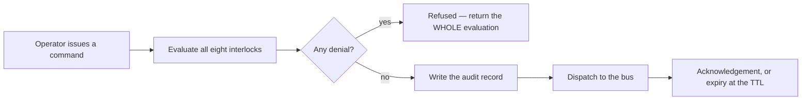

# Control, interlocks and operating modes

How CHAOS asks equipment to do something, the eight reasons it will refuse to
ask, and the mode system that decides how much authority it has at all.

Related: [The operator console § Control](./operator-console.md#48-control) ·
[Commissioning](./commissioning.md) ·
[Operations § Enabling physical control](./operations.md#7-enabling-physical-control) ·
[API reference § Control](./api.md#7-control)

---

## 1. The one rule everything else follows from

**The platform requests; local controllers decide.**

CHAOS sits at Level 3 of the control hierarchy. Level 3 may *request*; Levels 0
and 1 retain the authority to reject. Interlocks here are not a safety system —
the hardwired protection at Level 0 is. They are the platform's own refusal
layer: the set of conditions under which the twin declines to even ask.

If the local controller refuses a command, that is a **passing result**, not a
fault to work around.

---

## 2. Where you do this

The console's **Control** screen. Pick an asset and it lays out all seven things
the design document requires before anyone operates anything:

1. actual state
2. requested state
3. local/remote authority
4. interlocks currently preventing operation
5. last command and who issued it
6. manual override status
7. impact on energy and resource budgets

None of them is a tooltip, a hover, or hidden behind a disclosure triangle. Each
is a reason an operator might decide *not* to press the button, and a control
screen that hides its refusals teaches people to distrust it.

### Authority, in the screen's own words

| Authority | Means |
|---|---|
| Local | The equipment or its own controller has authority right now |
| Remote supervisory | The platform may request; the local controller still decides |
| Vendor-native | Commands go through the manufacturer's own controller |

---

## 3. Issuing a command

The command console on the Control screen shows its **preflight** before
anything is sent: exactly what will be written to the audit log, and every
reason the platform would refuse.

| Field | Why it is there |
|---|---|
| **Reason** | **Mandatory.** A command without a recorded reason is not auditable |
| **Time to live** | A command that cannot be delivered must expire, not queue forever |
| **Idempotency key** | A retried request returns the original command instead of issuing a second |
| **Dry run** | Evaluates every interlock and publishes nothing. **Use it first** |
| **Maintenance override** | A maintainer's explicit bypass of a maintenance lockout. Recorded in the audit log |
| **Depends on** | Point IDs whose measurements this decision rests on, recorded with the command |

### The order things happen in

**The audit record is written before dispatch**, so a command that was issued and
then lost in the network is still on the record.

### A refusal returns the whole picture

Not just the first objection. The design document requires the operator to be
shown the interlocks preventing operation, so a refusal comes back with every
interlock that was evaluated, whether it allowed or denied, and why.

Two refusal kinds are deliberately distinct:

| | Means |
|---|---|
| **Authority** | *You* may not |
| **Target state** | *Nobody* may right now — an interlock, a mode, a lockout |

### Dry run stays a dry run

A dry-run request passes the master gate so you can see the full interlock
picture — and is marked non-dispatching, and **stays** non-dispatching even when
physical control is enabled.

---

## 4. The eight interlocks

Evaluated in this order. The master switch is first so the most fundamental
refusal is the first line an operator reads.

| # | Code | Denies when |
|--:|---|---|
| 1 | `physical_control_disabled` | The platform-wide safety gate is off. It ships off |
| 2 | `asset_not_operational` | The asset is not in the registry, or its lifecycle status means it does not physically exist or must not be commanded |
| 3 | `point_not_control_capable` | The target point is not in the registry, or is a measurement rather than a command or setpoint point |
| 4 | `binding_not_commissioned` | There is no point binding, or the binding is not commissioned **and** explicitly flagged for automatic control |
| 5 | `emergency_mode_lockout` | A scope in the chain is latched into emergency and this command is not on the protective allow-list |
| 6 | `asset_in_maintenance` | A maintenance lockout is in the mode chain. A maintainer may proceed with an explicit override, which is recorded |
| 7 | `stale_input` | A measurement the decision depends on is missing, bad, stale, or older than the point's own timeout |
| 8 | `duplicate_in_flight` | Never denies. It **allows**, and reports the older in-flight commands that must be marked superseded |

### Two rules shape all of them

**Refuse by default.** A command that cannot be *proven* safe is denied. A
missing point, a missing binding, an absent measurement and an interlock that
raises an exception all deny. **Silence is never consent** — safety-critical
permissives must not default to permissive on missing data.

**Explain every decision.** Each interlock returns a machine-readable code and a
human reason. Both allow and deny results are recorded on the command and
returned to the operator.

### The ones worth understanding properly

**`asset_not_operational`.** Only `installed`, `commissioned`, `active` and
`degraded` accept commands. `concept`, `planned` and `procured` do not
physically exist; `failed` and `retired` must not be commanded; `reserve` is a
deliberate spare. `maintenance` is handled by interlock 6 instead, so the
operator sees *that* reason rather than a generic one.

**`binding_not_commissioned`.** Control capability in the point dictionary is
**not permission**. An absent binding is a denial, not a shrug: without one
there is no verified address to command. This is the interlock the commissioning
sequence exists to satisfy, one binding at a time.

**`emergency_mode_lockout`.** While a scope is latched into emergency, only
commands that unambiguously move equipment *towards* its safe state run: stop,
emergency stop, shutdown, disable, trip, open disconnect, close isolation valve,
shed load, set safe state, vent, silence alarm, acknowledge alarm. Ambiguous
verbs — `open`, `set_mode` — are deliberately excluded. A subsystem that needs
one has to pass its own allow-list and own that decision explicitly.

**`stale_input`.** Two sources are checked: the points the caller declares the
decision rests on (a missing current value **denies** — no data is not good
data), and the target point's own current value, which is advisory because
absence is normal for a command point. Staleness is judged both by the reported
quality code and by the point's own timeout, so **a device that stopped
publishing without anyone marking it stale still blocks control**.

> A valve whose position feedback has failed is not a valve the twin will stroke
> blind.

**`duplicate_in_flight`.** Issuing the newer request is the point, so this one
allows — but it names the older commands that must be superseded, so two
contradictory requests never sit on the wire at once.

### Extending the set

The registry is ordered and extensible: other subsystems can register additional
interlocks — the energy manager's power-budget check, for example — without
editing the built-in set. A registered interlock that raises is treated as a
denial.

---

## 5. Operating modes

Three scopes nest: **site** contains every **domain**, a domain contains its
**assets**. A command is judged against the **most restrictive** mode in that
chain, so putting the site into emergency locks every asset down without
touching a single asset record.

| Rank | Mode | Meaning for supervisory control |
|--:|---|---|
| 6 | `emergency` | Predefined protective state. **Latching.** Only the protective allow-list runs |
| 5 | `off` | Intentionally unavailable. Nothing should run at all |
| 4 | `maintenance` | Automatic starts inhibited, lockout visible. A maintainer may still act, with an explicit override |
| 3 | `degraded` | Reduced capability — failed sensor, comms, power or equipment. Automation continues but is not trusted with discretionary work |
| 2 | `manual` | Local or operator-directed control; the platform yields |
| 1 | `scheduled` | Runs to a calendar; supervisory targets still apply |
| 0 | `automatic` | Normal local control with supervisory targets. The default |

**`emergency` outranks `off`** because an off asset on an emergency site must
still refuse a start command *with the emergency reason*. The operator needs to
see **why** the property is locked down, not merely that one asset is idle.

### Latching means latching

- Setting `emergency` refuses to carry an expiry. **A latch with a timer is not
  a latch.**
- Mode expiry skips anything that is not auto-clearable.
- Clearing emergency requires a **named human** with at least the operator role,
  a reason, and an explicit assertion that the triggering condition is gone. The
  default for that assertion is false, so the default is refusal.

### Use maintenance mode, not alarm suppression

For planned work, put the scope into maintenance. It inhibits automatic starts
and modifies alarms **with the lockout visible**. Suppressing an alarm makes the
lockout invisible, which is how a subsystem gets left in maintenance mode for
three weeks. See [Operations § Alarm floods](./operations.md#3-alarm-floods).

---

## 6. The two safety gates

Two independent switches stand between this platform and physical plant.

| Gate | Scope | Set by |
|---|---|---|
| **The platform-wide gate** | Everything | Platform configuration. Ships **off** |
| **Per-binding automatic control** | One point | The commissioning endpoint, and only once the twelve-step sequence has passed for that asset |

**Turning on the global gate does not arm anything that has not been
commissioned.** That is deliberate: one switch should not be able to arm the
property.

The order is: pass the sequence → enable the binding → enable the global gate →
issue one command and read the audit record before issuing a second. Written out
in [Operations § Enabling physical control](./operations.md#7-enabling-physical-control).

---

## 7. The energy manager is not a relay board

The EMS publishes a site energy state and grants **time-limited power budgets**.
It does not switch things. The BMS, the inverters, the generator controller and
the local PLCs keep immediate equipment authority.

Its ten states — `COMMISSIONING`, `MAINTENANCE`, `SURPLUS`, `NORMAL`,
`CONSERVE`, `CRITICAL_RESERVE`, `GENERATOR_SUPPORT`, `EMERGENCY`, `BLACK_START`,
`DEGRADED_SENSOR` — are on the console's Energy screen, alongside the data
quality of every input the state was derived from. `EMERGENCY`, `MAINTENANCE`
and `COMMISSIONING` latch.

There is exactly **one energy manager on the property**, and it runs where the
plant is. A secondary node refuses to start one. See
[Secondary control node § Why it must not take over](./secondary-control-node.md#4-why-it-must-not-take-over).

---

## 8. A safety-relevant ambiguity you should know about

The field that says a point is trustworthy as a control *input* is the same
field the command path reads as permission to *actuate*. Eighty-six of the 245
bindings set it true, twelve of them on the energy manager's power-budget points
across all twelve load groups.

Nothing can be actuated today — every binding is `tbd`, the global gate is off,
and the interlocks hold. But commissioning one of those power-budget bindings
would flip a field that was set to mean "trustworthy input" into a grant to
command twelve load groups.

Until the concept is split into two fields, **do not bulk-set bindings to
commissioned**. Full write-up:
[Integration findings F-004](./integration-findings.md#f-004--automatic_control_allowed-is-semantically-overloaded).

---

## 9. Related reading

| Document | Why |
|---|---|
| [Commissioning](./commissioning.md) | The twelve steps that unlock per-binding control |
| [Operations](./operations.md) | Runbooks, including enabling and revoking physical control |
| [Alarms](./alarms.md) | Maintenance mode's effect on alarms |
| [Integration findings](./integration-findings.md) | F-004, and the load-tier off-by-one in F-006 |
| [API reference § Control](./api.md#7-control) | The command, mode and audit endpoints |
