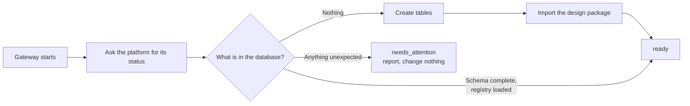

# Getting started

How to get Project CHAOS running and find your way to the screen you need.

Everything on this page is done through the product's own windows. Nothing here
requires a terminal. If you are setting up a headless secondary node or an
unattended install, the command line is still the right tool for that — it is in
[Command line](./advanced-command-line.md), and you can ignore it otherwise.

Next: [Building in Visual Studio 2026](./visual-studio.md) ·
[The desktop shell](./desktop-shell.md) ·
[The operator console](./operator-console.md)

---

## 1. What you are installing

Three things ship together and start as one.

| Piece | What it is | Where it listens |
|---|---|---|
| **Chaos.Shell** | The WinUI 3 desktop shell: launcher, console window, tray icon, annunciator window | Nothing. It is a client |
| **Chaos.Host** | The .NET 10 gateway: the only LAN listener, serves the console, proxies the API, runs first-run setup | `http://0.0.0.0:8080` |
| **The platform backend** | The Python control plane: registry, ingest, EMS, alarms, commands | `http://127.0.0.1:8081`, loopback only |

The backend is deliberately **not** reachable from the LAN. It is an
unauthenticated control API; it is reached through the gateway or not at all.
See [Network and trust boundaries](./network-and-trust-boundaries.md).

An **embedded Python runtime** ships inside the product, so the machine does not
need Python installed and cannot break the control plane by upgrading it. The
gateway resolves exactly `<install root>\python\python.exe`; finding a `python\`
directory with no interpreter in it, it treats the install as damaged and
refuses to fall back to a system Python, because borrowing the machine's Python
would run the control plane against dependency versions nobody tested.

---

## 2. Prerequisites

| Requirement | Why | If it is missing |
|---|---|---|
| Windows 10 build 17763 or later | The shell is Windows App SDK / WinUI 3 | The shell will not start |
| **Microsoft Edge WebView2 Evergreen Runtime** | The shell renders the console with WebView2 | The shell stays up and shows a panel titled *"WebView2 runtime is not installed"*, naming the component and the console URL. The platform is unaffected — the same console is still served to any browser on the LAN |
| A display, keyboard and mouse | This is the GUI path | Use [Command line](./advanced-command-line.md) instead |

The WebView2 installer is redistributable and works offline. Keep a copy on the
node: a homestead node may have no internet when you need it.

Nothing else. No Python, no Docker, no database server. The platform runs on
SQLite by default.

---

## 3. First launch

**Run `Chaos.Shell.exe`.** That is the procedure.

The launcher window opens, titled *"Project CHAOS — Start"*. It is laid out top
to bottom as: a headline, one paragraph of summary, a permanent run-mode banner,
the five checks, the actions, and a collapsed platform log.

### What you should see

**The headline** says one of these. Nothing else appears in that position:

| Headline | Meaning |
|---|---|
| *Starting Project CHAOS* | The shell is still contacting the gateway |
| *The platform is starting* / *The platform is coming up* | Something is starting; the shell is waiting for the gateway to answer |
| *This platform has not been set up yet* | The gateway is up and reports an empty database |
| *Setting up* | First-run setup is running now |
| *Project CHAOS is ready* | Gateway answering, backend up, setup reports ready |
| *The platform is only half up* | The gateway answers but reports its backend is down |
| *The platform is not answering* | Nothing answered, and there is something you can press |
| *The platform is not answering, and this shell cannot start it* | Nothing answered and no way to start it from here |

**The run-mode banner** sits directly under the summary and never collapses. It
states who owns the running platform, because an operator who believes the
platform is a Windows service, closes the window and walks away — when in fact
this shell was the parent process — has just switched off freeze protection on
their homestead without knowing it.

| Run mode | What the banner tells you |
|---|---|
| Windows service | It outlives this shell. Closing the window is harmless |
| Managed by this shell | This shell started it and it dies with this shell |
| Foreign | Something is answering that this shell did not start and no service accounts for |
| Not running | Positively established: no gateway answers and the service is installed and stopped |
| Unknown | The shell has not looked, or looked and could not tell. Never rendered as "stopped" |

**The five checks**, each with a state and a sentence:

| Check | Passes when |
|---|---|
| `Gateway at http://…:8080/` | The gateway answered, with its version |
| `Windows service '…'` | The service is running. *Not installed* is a warning, not a fault — a development checkout is a legitimate way to run this |
| `Platform executable` | `Chaos.Host.exe` was found, or is not needed because the service is running |
| `Platform backend` | The gateway reports the Python backend is up |
| `First-run setup` | The gateway reports the database is set up |

Every check starts *unknown* and only becomes *pass* on evidence. "The shell
cannot see it" is never written as "it is not running" — that distinction is
load-bearing on a property where the next diagnostic step might be a drive to a
container in the dark.

**The actions.** Every button is either pressable or carries the sentence saying
why it is not. You will see some subset of:

`Start platform` · `Set up now` (or `Run again`) · `Open console` ·
`Stop platform` · `Settings` · `Open logs` · `Restart as administrator` ·
`Check again`

The primary action for the current state is listed first.

### The two-click path

1. If the launcher offers **Start platform**, press it.
2. If it offers **Set up now**, press it. (With automatic setup left on — the
   default — the gateway has usually already done this before you got here.)
3. Press **Open console**.

---

## 4. What first-run setup does

Setup exists so that launching the shell *is* the installation procedure. It is
performed by the gateway, not by the shell and not by you.

On startup the gateway asks the platform for its own status. If the database is
empty it creates the tables and imports the design package. Both steps are the
platform's own operations, run against the same embedded interpreter that runs
the backend — so setup and the backend can never disagree about which Python is
in charge.

### The rule that matters

**Setup is only ever performed against a database with nothing in it.** Any row
anywhere means this database holds a homestead's history, and from that point
the gateway reports and stops. It never drops, truncates or migrates.

Three situations end as `needs_attention`, all of them reported with an
explanation and no changes made:

- rows present but declared tables missing — not a fresh install and not a
  complete one;
- schema complete but the registry only partly loaded — what an interrupted
  import looks like;
- schema complete, registry empty, but other tables already recording
  something.

The import itself is *additive*: it upserts and never drops. But re-running it
against a database that already holds registry rows is a decision for an
operator, not for startup — so the launcher offers you the button and the
gateway will not press it on its own.

### The six setup states

`/host/setup` reports one of these, and `/health` carries it too:

| State | Meaning |
|---|---|
| `not_started` | The gateway has not looked. Not evidence either way |
| `checking` | Assessing the database now |
| `running` | Setup is in flight |
| `ready` | Every declared table present, design package loaded |
| `failed` | A setup step failed. The launcher offers **Retry** |
| `needs_attention` | Something exists that the gateway will not modify unattended |

A gateway reporting healthy over a platform with no database would be a lie in a
different costume, so `failed` and `needs_attention` force `/health` to
`degraded`, and `checking` and `running` force `starting`, whatever the backend
says.

### What lands

After a successful setup, the launcher's setup rows and the console's Assets
screen should agree on these counts:

| Thing | Count |
|---|---|
| Assets | 90 |
| Points | 701 |
| Point bindings | 245 |
| Load-schedule records | 12 |
| Alarm definitions | 40 |

Most point bindings will read `tbd`. That is correct and it is the honest
measure of how much of the property is actually wired up rather than merely
modelled. See [The design package](./design-package.md).

---

## 5. Opening the console

Press **Open console** on the launcher, or **Open console** from the tray menu.

The console loads inside the shell window. Above it sits a thin command strip —
`Reload`, `Annunciator`, `Open in browser`, `Start screen`, `Settings` — and,
below that, the run-mode strip repeating who owns the running platform.

The console is deliberately not shown until the gateway has answered. Until then
you get a titled panel with the facts and next steps, not a blank white frame: a
blank frame looks like a hung application and invites the conclusion that the
platform is down when it may be running perfectly well behind a shell that
simply cannot see it.

### From another machine

The gateway serves the same console to any browser on the LAN at
`http://<node>:8080/`, and keeps doing so whether or not the desktop shell is
running. **Open in browser** on the command strip opens exactly that URL in the
default browser.

There is no login. Authentication terminates at your VPN or reverse proxy; the
console tells the API who you are, and a caller with no identity is a viewer who
can never write. Set your identity from the **operator button** in the top-right
of the console. See
[The operator console § Operator identity](./operator-console.md#3-operator-identity).

---

## 6. First things to look at

| Screen | What to check |
|---|---|
| **Home** | The state chip at the top, the freshness indicator, and any active alarms |
| **Annunciator** | Press the Annunciator button. Five of the forty tiles per bay should be dark, and ten should read `OUT OF SVC` — see below |
| **Assets** | 90 assets, most with lifecycle status `planned`. That is the truth: nothing is installed |
| **Topology** | 137 nodes. The register holds 90; the water extension adds 47 more at render time |
| **Rack** | A 42U elevation marked *not ratified*, with its own list of findings |

**Ten tiles reading `OUT OF SVC` on a fresh install is expected, not a fault.**
Those ten alarm definitions are enabled but their trigger points do not exist
for their assets, so they can never light. The panel reports that rather than
showing them dark, because a dark tile is a positive claim that the condition is
normal. All three tiles in the SAFETY bay are among them. This is
[integration finding F-007](./integration-findings.md#f-007--ten-of-the-forty-alarms-can-never-fire),
and it is a gap in the design package that needs closing before those alarms
mean anything.

---

## 7. Where the product keeps things

| What | Where |
|---|---|
| Shell settings | `%APPDATA%\ProjectCHAOS\Shell\settings.json` |
| Shell window layout | `%APPDATA%\ProjectCHAOS\Shell\layout.json` |
| Shell and platform logs | `%ProgramData%\Project CHAOS\logs` |
| Gateway configuration | `chaos.host.json` in the install's config directory. Written once by the installer, never overwritten by an upgrade, never removed by an uninstall |
| Install paths | The registry key `HKLM\SOFTWARE\Project CHAOS` — the installer keeps it current across upgrades so nothing hard-codes a path that an upgrade might move |

Settings and layout are separate files on purpose: layout is disposable cosmetic
state rewritten on every window move; settings are deliberate operator choices
that must not be lost because a layout write raced with a crash.

**Open logs** on the launcher, and **Open logs folder** on the diagnostic panel,
open that directory in Explorer. You never need to type the path.

---

## 8. What to read next

| You want to… | Read |
|---|---|
| Build or debug it | [Building in Visual Studio 2026](./visual-studio.md) |
| Learn the shell's windows and settings | [The desktop shell](./desktop-shell.md) |
| Learn the console's screens | [The operator console](./operator-console.md) |
| Learn the alarm panel | [The annunciator panel](./annunciator.md) |
| Fix something | [Troubleshooting](./troubleshooting.md) |
| Understand how it all fits | [Architecture](./architecture.md) |
