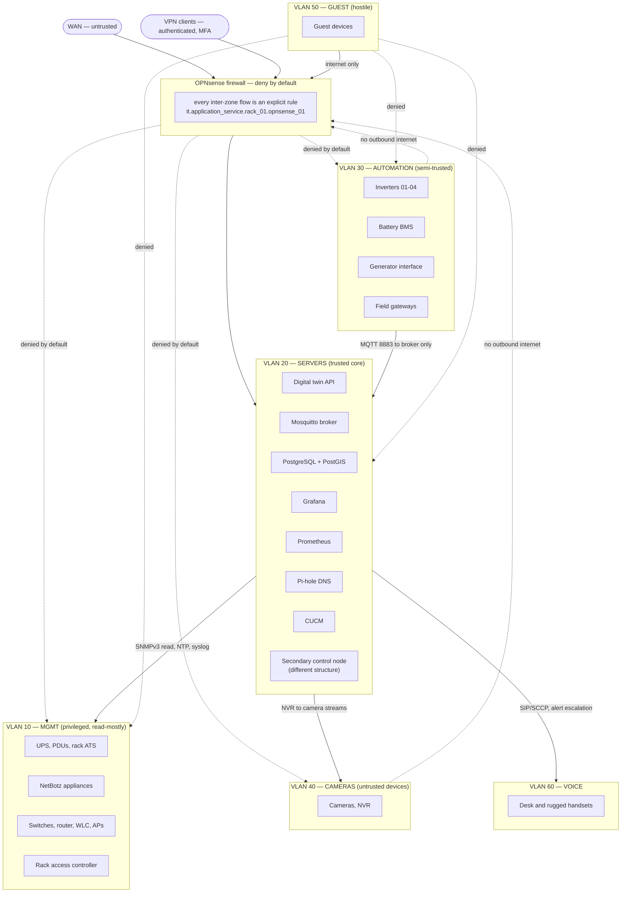
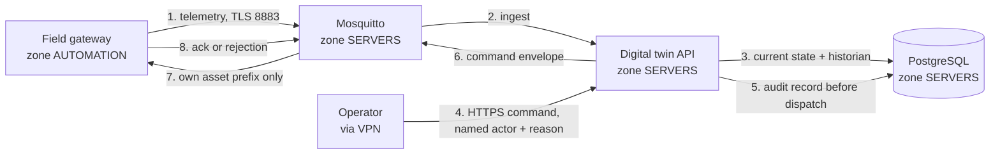

# Network and trust boundaries

The zones, the boundaries between them, the flows that are permitted across
each, and the identities that use them.

This matters for one reason above all others: **the platform API does not
authenticate anyone.** It records who an action was taken by; deciding who may
reach it at all is this document's job.

Related: [Architecture](./architecture.md) ·
[API reference § Identity and roles](./api.md#2-identity-and-roles) ·
[Secondary control node](./secondary-control-node.md) ·
[Container deployment](./advanced-container-deployment.md)

Sources: the design document's VLAN scheme, network placement, identity and
access, remote access and broker authorisation sections, and
`data/homestead_asset_register.yaml` for the equipment.

---

## 0. What this document does not decide

**Host addressing is an open item.** Every `management_ip` in the asset register
reads `TBD`, `DHCP_TBD` or `iDRAC_DHCP_or_static_TBD`, and each VLAN asset lists
`gateway_ip`, `dhcp_scope`, `firewall_rules` and `dns_policy` in its
`open_fields`. That is deliberate: the register records the addressing plan as
undecided rather than disguising a guess as a decision.

So this document uses **zone names**, not addresses. Every rule below reads
"source zone → destination zone", and is implementable as an interface- or
alias-based rule on OPNsense today. Substituting host addresses is a mechanical
step once SDD 49 item 4 (rack-unit positions, PDU outlets, switch ports, VLANs
and power feeds) is complete.

The VLAN IDs and the `/24` subnets are **not** invented — both appear in SDD 3.3
and in each `it.network_segment.site.vlan_*` asset's `properties`. Individual
host addresses within them do not exist yet.

Also unresolved and referenced below rather than assumed:

- **SDD 22.9** — the exact remote-access and offsite-backup architecture.
- **SDD 22.2** — virtualization platform and container/VM deployment model.
- **SDD 22.13** — whether the secondary control node lives in the residence, the
  workshop, or another enclosure. Its zone placement here is therefore
  provisional.

---

## 1. The six approved zones

From SDD 3.3, reproduced verbatim in the register. Every VLAN asset carries
`default_inter_vlan_policy: deny_except_explicit_allow`.

| VLAN | Subnet | Zone name | Purpose | Criticality (register) |
|---:|---|---|---|---|
| 10 | 10.10.10.0/24 | `MGMT` | Management and out-of-band: PDUs, UPS, NetBotz, switches, router, WLC, access points, rack access | critical |
| 20 | 10.10.20.0/24 | `SERVERS` | Servers and core services | critical |
| 30 | 10.10.30.0/24 | `AUTOMATION` | Automation and IoT: inverters, BMS, generator interface, field gateways | critical |
| 40 | 10.10.40.0/24 | `CAMERAS` | Cameras and NVR | important |
| 50 | 10.10.50.0/24 | `GUEST` | Guest Wi-Fi | important |
| 60 | 10.10.60.0/24 | `VOICE` | Voice and telephony | important |

Two zones exist that are not VLANs and must be named to write honest rules:

| Zone | Meaning |
|---|---|
| `WAN` | The upstream internet connection, through `it.router.rack_01.isr4321_01` and the OPNsense firewall |
| `VPN` | Remote-access clients terminated on the firewall (SDD 15.3) |

The register does not model a separate secondary-node VLAN. The secondary node
asset (`it.server.secondary_control_node.01`) records `vlan_id: 20`, so it sits
in `SERVERS` — while being required to live in a different *structure*
(`must_be_outside_common_failure_domain: true`). Same zone, different building.
That is a physical-separation requirement, not a network-separation one, and
section 6 discusses whether that is the right answer.

---

## 2. Trust boundaries

Solid arrows are permitted flows; dashed arrows are denials worth stating
explicitly. Everything not drawn is denied, because the default is deny.

### Why the boundaries fall where they do

**`AUTOMATION` is semi-trusted, not trusted.** It holds the inverters, the BMS
and the generator interface — the equipment with the most physical authority on
the property — behind vendor firmware that will not be patched on any schedule
you control. SDD 5.8 puts it plainly: IoT devices are not trustworthy merely
because they are on private land. So `AUTOMATION` gets exactly one path into
`SERVERS`: the broker. Not the database, not the API, not SSH.

**`MGMT` is privileged and therefore reached *from* `SERVERS`, never the
reverse.** A NetBotz or a PDU that can initiate a connection into the server
zone is a pivot. Monitoring polls outward; management devices answer.

**`CAMERAS` is treated as hostile.** Cameras are the single worst class of device
for firmware quality. They get no outbound internet and no lateral access.

**`GUEST` reaches the internet and nothing else.** That includes DNS: guests use
an upstream resolver, not Pi-hole, so a guest device cannot enumerate internal
names.

---

## 3. Firewall flow table

Deny by default (SDD 15.1). Each row is an explicit allow. `EST` means the
return path is permitted by stateful inspection only, not by a second rule.

| # | Source zone | Destination zone | Protocol / port | Purpose | Justification |
|---:|---|---|---|---|---|
| 1 | `AUTOMATION` | `SERVERS` (broker) | TCP 8883 (TLS), TCP 1883 during commissioning | Field gateways, inverters and BMS publish telemetry and receive commands | SDD 15.1 "VLAN 30 gateways to MQTT/API services in VLAN 20". The single sanctioned path out of the automation zone. Port 1883 is a commissioning-only exception and closes at SDD 19 step 12 |
| 2 | `AUTOMATION` | `SERVERS` (twin API) | TCP 443 | Gateways that integrate over HTTP rather than MQTT | Same SDD clause. Grant per device, not zone-wide; most gateways need only rule 1 |
| 3 | `SERVERS` | `AUTOMATION` | TCP 502 (Modbus), vendor API port | Poll inverters, BMS and generator where the device cannot publish | SDD 15.1 "VLAN 20 monitoring services to approved SNMP/Modbus endpoints". Modbus/TCP has no authentication or encryption, so this must be per-device, not zone-wide |
| 4 | `SERVERS` | `MGMT` | UDP 161 (SNMPv3) | Poll UPS, PDUs, rack ATS, NetBotz, switches, router, WLC | SDD 8.7 infrastructure monitoring. **SNMPv3 authPriv with a per-device credential.** v2c community strings are plaintext passwords shared across a fleet, which SDD 15.2 rules out |
| 5 | `SERVERS` | `MGMT` | TCP 443 | NetBotz and APC web APIs where SNMP is insufficient | SDD 8.7. Read-only service accounts |
| 6 | `SERVERS` | `MGMT` | TCP 22 | Operator SSH to switches and router, from the twin/jump host only | Device administration. Named accounts, key auth (SDD 15.2) |
| 7 | `MGMT` | `SERVERS` (syslog) | UDP 514 / TCP 6514 | Switch, router, WLC and firewall logs | SDD 8.7 log collection. One of only two flows *from* `MGMT`, and it is write-only into a collector |
| 8 | `MGMT` | `SERVERS` (NTP) | UDP 123 | Time sync for switches, PDUs, NetBotz | SDD 16.3: all servers, gateways, PLCs, cameras and field nodes use the homestead NTP service |
| 9 | `AUTOMATION` | `SERVERS` (NTP) | UDP 123 | Time sync for gateways and controllers | SDD 16.3. Correlating an alarm with a command needs agreeing clocks |
| 10 | `CAMERAS` | `SERVERS` (NTP) | UDP 123 | Time sync for cameras | SDD 16.3. Footage timestamps must agree with the alarm timeline |
| 11 | `VOICE` | `SERVERS` (NTP) | UDP 123 | Time sync for handsets | SDD 16.3 |
| 12 | `SERVERS` (NVR) | `CAMERAS` | TCP 554 (RTSP), vendor port | Video ingest | SDD 15.1 "NVR in approved server/camera path to VLAN 40 cameras". NVR host only, not the whole zone |
| 13 | `SERVERS` (alert service) | `VOICE` | TCP 5060/5061, CUCM ports | Voice escalation for critical alarms | SDD 15.1 "Alert service to CUCM/voice services as required", FR-007 |
| 14 | `VOICE` | `SERVERS` (CUCM) | TCP 2000 (SCCP) or 5060/5061 (SIP), TFTP 69 | Handset registration and provisioning | Protocol choice is TBD in the register (`SCCP_or_SIP_TBD`) — open both only after it is decided |
| 15 | `MGMT` (APs) | `SERVERS`/`MGMT` (WLC) | UDP 5246/5247 (CAPWAP) | Access-point control and data tunnels | Register records CAPWAP for all five Aironet 3702e |
| 16 | `GUEST` | `WAN` | TCP 80/443, UDP 443, DNS to upstream | Guest internet | SDD 3.3. **No** access to any internal zone, and no internal DNS |
| 17 | `SERVERS` | `WAN` | TCP 443, UDP 123 | Package updates, upstream NTP, outbound notification (email/push) | SDD 16.3 external time source when available; FR-007 alerting. Per-host, not zone-wide |
| 18 | `VPN` | `SERVERS` | TCP 443 (twin API, Grafana) | Remote operator access | SDD 15.3: remote access terminates on a VPN under user control |
| 19 | `VPN` | `MGMT` | TCP 22, 443 | Remote administration | SDD 15.2 requires MFA for remote administration. Administrator role only |
| 20 | `WAN` | `VPN` endpoint | UDP 51820 (WireGuard) or chosen VPN port | The only inbound flow from the internet | SDD 15.3. Architecture is SDD open decision 22.9 |
| — | `SERVERS` ↔ `SERVERS` | | | Intra-zone service traffic (twin↔broker↔database↔Grafana) | Within one compose network on one host; if services are split across hosts, each pair becomes an explicit rule |

### Explicit denials worth writing as rules

Deny-by-default already covers these. Write them anyway, with logging: a hit is
an incident, and a silent drop teaches you nothing.

| Source | Destination | Why it must be denied and logged |
|---|---|---|
| `AUTOMATION` | `WAN` | SDD 15.1: "No direct internet access for most controllers." An inverter phoning home is exfiltration and an unpatched update channel |
| `CAMERAS` | `WAN` | Same reasoning, more so |
| `CAMERAS` | any internal zone | A camera never initiates anything. The NVR pulls |
| `GUEST` | `MGMT`, `SERVERS`, `AUTOMATION`, `CAMERAS`, `VOICE` | Guest is hostile by assumption |
| `MGMT` | `WAN` | A PDU or NetBotz reaching the internet is either compromised or misconfigured |
| `AUTOMATION` | `AUTOMATION` | Consider intra-zone isolation (private VLAN / switch port isolation). A compromised soil sensor has no business reaching the BMS |
| `WAN` | anything except the VPN endpoint | SDD 15.3: no port-forwarded Home Assistant, PLC, inverter, camera, NetBotz or PDU interfaces. Ever |

The last one deserves emphasis. Every one of those interfaces is a known
credential-stuffing target, and the inverter and BMS interfaces sit directly on
the equipment that keeps the property alive.

---

## 4. Service identities

SDD 15.2 requires named operator accounts, separate service accounts,
role-based permissions and audited control actions. Three identity planes exist
and they are not interchangeable.

### 4.1 Human roles (digital twin API)

`api/deps.py` implements the SDD 15.2 role ladder, least privilege first:

| Role | May |
|---|---|
| `viewer` | Read state, history, alarms, registry |
| `operator` | Acknowledge alarms, issue commands, request power-budget leases, set operating modes |
| `maintainer` | Work orders, inspections, calibrations, commissioning records |
| `administrator` | Registry reload, alarm-definition reload, configuration change |

A caller with no identity is a `viewer` and can never write. Authentication
terminates at the reverse proxy or VPN (SDD 15.3); the platform still records a
named actor on every audited action, so an anonymous request cannot mutate
anything.

**Open item:** MFA for remote administration (SDD 15.2) is enforced at the VPN,
not by this platform, and the VPN is SDD open decision 22.9.

### 4.2 Service identities (MQTT)

One identity per service and per device, with topic-prefix authorisation. Full
rationale in `deploy/mosquitto/README.md`; the worked ACL is
`deploy/mosquitto/acl.example`.

| Identity | Zone | Publishes | Subscribes |
|---|---|---|---|
| `svc-twin-primary` | `SERVERS` | Commands, setpoints, alarms, own availability | Everything |
| `svc-twin-secondary` | `SERVERS` (other structure) | Own availability and alarms only — **never commands** | Everything |
| `svc-bridge-secondary` | `SERVERS` | Bridge availability only | Everything, inbound |
| `svc-node-red` | `SERVERS` | Own topics; command rights per delegated domain, added at commissioning | Everything |
| `svc-home-assistant` | `SERVERS` | Own topics | Everything |
| `svc-historian`, `svc-grafana` | `SERVERS` | Nothing | Everything |
| `svc-healthcheck` | `SERVERS` | Nothing | `$SYS/broker/uptime` |
| `gw-power-container` | `AUTOMATION` | Telemetry, events and command acks for its own assets only | Commands and setpoints for its own assets only |
| `gw-rack-power` | `MGMT`→`SERVERS` | Telemetry for UPS, PDU and NetBotz assets | Commands for the switched PDU only |
| `dev-*` sensors | `AUTOMATION` | Own asset telemetry only | Nothing |

The asymmetry is the design. The twin publishes commands but not telemetry — a
twin that could write telemetry could paper over a real condition. Gateways
publish telemetry but never commands, not even to themselves.

### 4.3 Device identities (management plane)

| Class | Mechanism | Status |
|---|---|---|
| Switches, router, WLC | SSH key per operator, TACACS+/RADIUS if deployed | **Open** — AAA architecture not decided |
| UPS, PDUs, rack ATS, NetBotz | SNMPv3 authPriv per device + local admin account | **Open** — credentials not issued |
| Servers (iDRAC/Redfish) | Per-host credential, MGMT zone only | **Open** |
| Inverters, BMS, generator | Vendor-dependent | **Open** — SDD 22.6 has not selected the products |
| MQTT clients | Password now, client certificate later | Password path implemented; TLS listener present but disabled |

Every row marked "Open" is a credential that does not exist yet, not one that has
been issued and omitted from this document.

### 4.4 Recording identities in the registry

An MQTT username, an SNMPv3 user or a Home Assistant entity ID is a **binding**,
not an identity (SDD 25.3 rule 7). Record them as `ExternalIdentifier` rows
against the asset (`id_type: mqtt_username`, `snmp_v3_user`, `ha_entity_id`), so
they survive in the same place as the equipment they belong to and are captured
by `chaos backup`. A spreadsheet of device credentials is a spreadsheet
that will be wrong within a year.

Secrets themselves are never stored in the registry, never in Git, and never in
`deploy/.env.example`.

---

## 5. Where the platform's own traffic goes

Step 5 before step 6 is not an implementation detail. The audit record is written
before the command leaves the platform, so a command that was issued and then
lost in the network is still on the record (SDD 5.7, FR-004).

Step 7 is where the ACL earns its keep: the broker delivers the command only to
the identity that owns that asset prefix.

---

## 6. Open items

| # | Item | Blocked on |
|---:|---|---|
| 1 | Host addressing: gateway IPs, DHCP scopes, static assignments | SDD 49 item 4 |
| 2 | Switch port, VLAN and PDU outlet assignment per device | SDD 49 item 4 |
| 3 | Remote-access architecture: VPN product, MFA provider, offsite backup target | SDD open decision 22.9 |
| 4 | TLS: private CA, certificate issuance and rotation for brokers and gateways | Deployment decision; broker config is ready |
| 5 | Network AAA: TACACS+/RADIUS versus local accounts on switches and router | Not yet raised in the SDD |
| 6 | Inverter, BMS and generator protocols and ports | SDD open decision 22.6 — the register records `modbus_tcp_or_vendor_api_TBD`. Related: `docs/design-decisions/DD-004-controller-family.md` |
| 7 | Voice signalling: SCCP versus SIP | Register records `SCCP_or_SIP_TBD` |
| 8 | Whether the secondary control node should be in `SERVERS` at all | SDD open decision 22.13; `docs/design-decisions/DD-003-secondary-control-node-placement.md` (status *proposed*) |
| 9 | Intra-zone isolation within `AUTOMATION` | Depends on switch capability and port assignment |
| 10 | DNS policy per zone (`open_fields` on every VLAN asset) | Pi-hole deployment |

### On item 8

The register places the secondary control node on VLAN 20 with the primary. That
is defensible — it needs the same broker and the same database replication path —
but it means a compromise of the server zone reaches both nodes, and the whole
point of the secondary node is to survive a failure of the primary's environment
(SDD 16.1).

Physical separation without network separation protects against fire, water and
HVAC failure. It does not protect against a network-borne compromise. If the
threat model should include the latter, the secondary node wants its own zone
with a narrow allow-list: inbound MQTT bridge, database replication, outbound
notification. Recommended, not decided — SDD 22.13 has not chosen the host
structure yet, and that choice constrains this one.

---

## 7. Related reading

| Document | Why |
|---|---|
| [Architecture](./architecture.md) | Why the platform backend is on loopback and the gateway is the only listener |
| [API reference](./api.md) | The role model these identities map onto |
| [Secondary control node](./secondary-control-node.md) | Item 7 above, in its own context |
| [Container deployment](./advanced-container-deployment.md) | Where the bind addresses and broker identities are actually configured |
| [Commissioning](./commissioning.md) | Step 12 re-runs the broker permission verification for each new identity |
