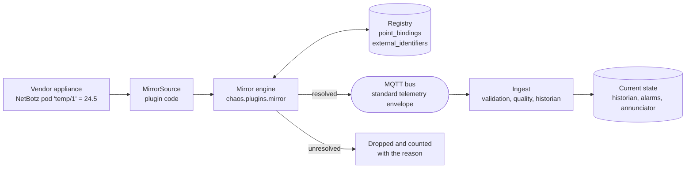

# Plugins and third-party integrations

CHAOS talks to equipment it did not design: an APC NetBotz on the container
wall, a UPS network card, a switched PDU, a weather station, whatever the
property acquires next. The plugin system is how those systems become part of
the platform **without any core module learning that they exist**.

One sentence carries the whole design:

> A plugin supplies vendor data. The registry decides what that data *is*.

Everything else here follows from that. A plugin can offer a temperature
reading; it cannot decide that the reading is
`it.environmental_monitor.rack_01.nbrk0550_01/temperature_air_c`. That is a
registry fact, and SDD section 26.2 is explicit that parsing a vendor string is
not an identity mechanism. A reading the registry cannot place is dropped and
counted — never written under a guessed identity, and never allowed to create a
point.

Related: [Architecture](./architecture.md) ·
[API reference § Plugins](./api.md#11-plugins) ·
[The design package](./design-package.md) ·
[Commissioning](./commissioning.md)

---

## 1. What a plugin may contribute

Four things, and nothing else.

| Capability | What it means | Mounted / started where |
|---|---|---|
| `api` | FastAPI routers | `/api/v1/ext/<plugin>` |
| `mirror` | Sources that read a vendor system and hand back readings | The mirror engine |
| `service` | Long-running background services | `ServiceManager`, alongside ingest and the EMS |
| health | One honest answer to "is this working" | `GET /api/v1/plugins` |

The `/ext/` prefix is **not negotiable and plugins do not choose it**. A plugin
that could mount at `/api/v1/commands` could shadow the command API on a
platform where a URL can start a pump, and a reader of a URL could not tell core
from vendor. Plugin routers are also included *after* every core router, so a
plugin cannot change the order in which core routes are matched.

---

## 2. How a vendor reading becomes a point

This is the part worth understanding, because it is where the safety property
lives.



Two things about that diagram matter more than the boxes.

**The mirror publishes; it does not write.** A resolved reading goes onto the
bus as an ordinary telemetry envelope — the SDD section 10.2 schema every field
device uses — on the same topic ingest would resolve that point on. Ingest then
applies its normal rules: enum and range validation, quality, out-of-order
detection, historian policy, dead-lettering.
So there is exactly one write path into the historian, a vendor integration is
no more trusted than a field device, and every feature the platform already has
works on mirrored data without knowing it is mirrored.

**Identity comes from one of two registry rows**, tried in this order:

| Route | The row | When you use it |
|---|---|---|
| Binding address | `point_bindings.source_protocol` = the plugin's protocol, `source_address` = the vendor's own address | Per-point, exact. This is what commissioning fills in, and it wins |
| External identifier | `external_identifiers` with `id_type` = the plugin's type, `value` = the appliance's own ID | Mirrors a whole appliance in one row, before per-point commissioning |

A reading is normally offered by both at once, which is what lets an integration
work before *and* after field commissioning — the span during which somebody
actually wants to know whether the rack is getting warm.

### Placeholder addresses are not addresses

The v0.3 design package carries `source_address: TBD` on every SNMP binding.
The mirror engine skips those. Treating `TBD` as a vendor address would make six
UPS points collide on one key and would claim a binding that field work has not
done. An uncommissioned point therefore resolves to nothing, and says so.

---

## 3. Writing a plugin

### In-tree

A **package** under `chaos/plugins/` exposing `PLUGIN`:

```python
# src/chaos/plugins/my_gateway/__init__.py
from chaos.plugins import PluginBase, PluginHealth, PluginManifest


class MyGatewayPlugin(PluginBase):
    manifest = PluginManifest(
        name="my_gateway",
        version="0.1.0",
        summary="Mirrors the widget gateway",
        capabilities=("mirror",),
        required_options=("host",),
    )

    def setup(self, context):
        super().setup(context)
        self.client = WidgetClient(context.option("host"), context.int_option("port", 502))

    def mirror_sources(self):
        return (WidgetMirrorSource(self.client),)

    def health(self):
        return PluginHealth.ok("connected") if self.client.connected else PluginHealth.degraded(
            "The gateway is configured but not answering"
        )


PLUGIN = MyGatewayPlugin()
```

Only packages are discovered, which is why the framework modules beside them —
`spec.py`, `manager.py`, `mirror.py` — need no exclusion list and can never be
mistaken for plugins.

### Installed separately

Any distribution advertising the `chaos.plugins` entry-point group. This is the
path for an integration that should not live in this repository: a site-specific
vendor bridge, or one with a dependency the platform must not take on.

```toml
[project.entry-points."chaos.plugins"]
my_gateway = "my_package.gateway:PLUGIN"
```

Same contract, same isolation, same screens. The only difference is the
`origin` field, which reads `entry_point` instead of `builtin`.

### A mirror source

```python
class WidgetMirrorSource:
    plugin = "my_gateway"
    protocol = "widget_modbus"      # matches point_bindings.source_protocol
    id_type = "widget.gateway"      # matches external_identifiers.id_type
    poll_interval_s = 30.0

    def available(self) -> bool:
        return self.client.connected

    def read(self):
        for tag, value in self.client.poll():
            yield MirrorReading(
                value=value,
                external_id=tag.address,       # binding route
                device_id=tag.device,          # external-identifier route
                point_name="temperature_air_c",
                alternate_point_names=("temperature_c", "value"),
            )
```

`alternate_point_names` exists because one vendor sensor means different
canonical points depending on what it is attached to — a temperature probe is
`temperature_air_c` on an `environmental_monitor` and `value` on a
`safety_sensor`. The source offers the candidates in preference order; the
registry picks the one that exists.

---

## 4. Configuration

| Variable | Default | Effect |
|---|---|---|
| `CHAOS_PLUGINS_ENABLED` | `*` | `*` for every plugin found, or a comma-separated list |
| `CHAOS_PLUGINS_DISABLED` | *(empty)* | Comma-separated. **Always wins** over the enabled list |
| `CHAOS_PLUGIN_MIRROR_ENABLED` | `true` | Whether the mirror engine runs on this node |
| `CHAOS_PLUGIN_OPTIONS` | *(empty)* | JSON object keyed by plugin name |
| `CHAOS_PLUGIN_<NAME>_<KEY>` | — | One option. **Overrides the JSON document** |

One line takes a misbehaving vendor integration out of the platform without a
rebuild:

```
CHAOS_PLUGINS_DISABLED=netbotz
```

**Credentials belong in `CHAOS_PLUGIN_<NAME>_<KEY>`**, not in the JSON document.
Option *values* are never logged and are never returned by the API or printed by
the CLI — only the key names are, which is what diagnosing needs and is safe to
put on a wall display.

A plugin's manifest can also restrict it by node role. Environmental monitoring
runs on both nodes; an integration that commands equipment declares
`node_roles=("primary",)`, because two nodes dispatching would give the site two
supervisory control sources — the split-brain the
[secondary control node](./secondary-control-node.md) exists to avoid.

---

## 5. Health: five states, and why not two

`GET /api/v1/plugins` and `chaos plugins` report one of five states per plugin.
They are deliberately not collapsed into a green/red light.

| State | Means | What to do |
|---|---|---|
| `ok` | Configured, and the last exchange with the vendor system worked | Nothing |
| `degraded` | Configured, and the last exchange **failed** | Something that used to work does not. This is the one that should page somebody |
| `not_configured` | Never set up. Not broken — never asked to run | Supply the options the detail line names |
| `failed` | The plugin itself is broken: import error, bad manifest, `setup()` raised | Read the detail; nothing it contributes is loaded |
| `disabled` | Excluded by configuration or by node role | Nothing, if that was intentional |

`not_configured` and `degraded` produce the identical empty graph and need
opposite responses. That is the entire reason the field exists.

A plugin that fails is still **in the list**, red, carrying the reason. "It is
not in the list" and "it is in the list with the import error" are very
different things to be looking at when an integration has stopped delivering
data.

---

## 6. The NetBotz plugin

The reference implementation, and the worked example every other integration
should be read against. It ships enabled.

**What is complete and tested:** the sensor mapping (vendor type → canonical
point, with aliases and unit conversion), both identity routes, the API, and the
health reporting. There is a test asserting that every point name the mapping
can publish exists in `data/point_dictionary.yaml`, so the catalogue cannot
drift into producing dead letters.

**What is not:** the network transport. `UnconfiguredTransport` returns no
readings and reports exactly what implementing SNMP or HTTPS would require. The
plugin therefore reports `not_configured` on a real deployment and **never
reports a temperature that did not come from a device**. An integration you
believe in but that does not exist is worse than no integration, because the
temperature it is not reporting looks like a temperature that is fine — the same
rule the [notification channels](./alarms.md) live under.

Four sensor types are listed and deliberately **not** mapped: airflow, audio,
vibration and camera motion. Each is a real NetBotz capability with no point in
the dictionary. Mirroring one would mean inventing a point, which is a design
decision for the property owner and not an integration's to make, so they
surface as unmirrorable rather than disappearing.

### Commissioning it

One `external_identifiers` row is the whole minimum step:

| Column | Value |
|---|---|
| `asset_id` | `it.environmental_monitor.rack_01.nbrk0550_01` |
| `id_type` | `netbotz.enclosure` |
| `value` | the appliance's own ID |

`GET /api/v1/ext/netbotz/bindings` then answers the question that actually comes
up — *why is the NetBotz not showing anything?* — by reporting which registry
rows exist and which are still `TBD`. "The appliance is unreachable" and
"nothing is bound to it" look identical on a dashboard and have opposite fixes.

### Options

| Option | Values | Meaning |
|---|---|---|
| `CHAOS_PLUGIN_NETBOTZ_TRANSPORT` | `none`, `snmp`, `http` | Which transport to use. Both real ones are unimplemented in this release |
| `CHAOS_PLUGIN_NETBOTZ_HOST` | An address on VLAN 10 | The appliance |
| `CHAOS_PLUGIN_NETBOTZ_POLL_INTERVAL_S` | seconds, default `30` | Clamped to 1–3600 |

---

## 7. What a plugin may not do

Not conventions — structural properties, each with a test behind it.

- **Invent identity.** Readings resolve through registry rows or they are
  dropped. There is no path by which a vendor string becomes a point nobody
  registered.
- **Write to the database.** The mirror publishes envelopes; ingest writes.
- **Mount outside `/ext/`,** shadow a core route, or change core route order.
- **Take the platform down.** Import, manifest validation, `setup()`, each
  contribution method, each poll and each health check are individually
  isolated. A broken integration is a red row on a screen; the greenhouse still
  gets heat.
- **Claim another plugin's name** for a mirror source, which would file its
  counters and its failures against somebody else.
- **Gain routes at runtime.** `POST /api/v1/plugins/reload` re-reads options,
  transports, health and mirror sources — and says plainly that the route table
  did not move. FastAPI builds routing at startup; a reload that silently left
  stale routes behind while claiming success would be the more dangerous of the
  two behaviours.

---

## 8. Seeing what is loaded

Without starting anything, contacting any vendor system, or needing a database:

```
chaos plugins
chaos plugins --json
chaos plugins --strict     # non-zero if any plugin failed to load
```

Through the API:

| Method | Path | Purpose |
|---|---|---|
| `GET` | `/api/v1/plugins` | Every plugin, its manifest, its health, which option keys are set |
| `GET` | `/api/v1/plugins/mirror` | What the mirror engine is carrying: counters, drops with reasons, unresolved vendor addresses |
| `GET` | `/api/v1/plugins/{name}` | One plugin in detail |
| `POST` | `/api/v1/plugins/reload` | Re-read configuration. Administrator, with a reason |

`/api/v1/plugins/mirror` is the one to open when data has stopped arriving: it
reports, per source, how many readings were seen, how many were published, and
how many were dropped under each reason — with example vendor addresses for the
unresolved ones, which is the list commissioning works through.

---

## 9. Related reading

| Document | Why |
|---|---|
| [Architecture](./architecture.md) | Where the plugin system sits in the platform |
| [API reference § Plugins](./api.md#11-plugins) | The endpoint contract |
| [The design package](./design-package.md) | `point_bindings` and `external_identifiers`, and why the registry owns identity |
| [Commissioning](./commissioning.md) | The sequence that fills in a binding address |
| [Secondary control node](./secondary-control-node.md) | Why a manifest restricts some plugins to one node |
| [Integration findings](./integration-findings.md) | What happens when a published point is not in the dictionary |
