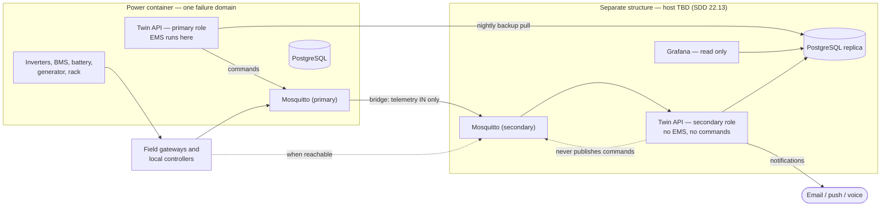

# Secondary control node

SDD section 49 work-queue item 6: *"Define the primary and physically separate
secondary-control-node deployment architecture."*
SDD section 16.1 mitigations 2, 4 and 6; SDD section 16.2.

Deployment file: `deploy/docker-compose.secondary.yml`.
Register asset: `it.server.secondary_control_node.01`.

---

## 1. The risk this node exists for

SDD 16.1 states the problem without hedging:

> Housing batteries, power conversion, utilities, and the primary server rack in
> one 20-foot container creates a common physical failure domain. Fire, smoke,
> overheating, water ingress, electrical fault, or container HVAC failure could
> remove both the plant being controlled and the master controller.
>
> The software design must therefore assume complete loss of that container.

Everything in `deploy/docker-compose.yml` — PostgreSQL, Mosquitto, the twin API,
Grafana, Prometheus — lives in that container. So does the R740xd, the UPS, the
PDUs, the switches, the inverters, the BMS and the battery bank.

The container is not a rack you can lose gracefully. It is the rack **and** the
plant, in the same box, sharing an airflow path that SDD open decision 22.12 has
not yet resolved.

The five required mitigations, and where each is handled:

| # | SDD 16.1 mitigation | Where |
|---:|---|---|
| 1 | Local controllers continue safe subsystem operation without the server rack | Level 1 hardware. Not software — see section 3 |
| 2 | A small secondary control node in a separate structure | **This document** |
| 3 | Critical configuration and asset data replicated outside the container | `homestead-twin backup`, `deploy/backup/backup.sh` |
| 4 | Essential alerts can originate from independent local devices | Partly this node; partly NetBotz native email — see section 7 |
| 5 | Battery and server zones physically separated with independent monitoring | Physical design. SDD open decision 22.12 |
| 6 | The secondary node provides a reduced dashboard, MQTT bridge, and emergency communications | **This document** |

---

## 2. What runs there

`deploy/docker-compose.secondary.yml` starts four services.

| Service | Role | Differences from the primary |
|---|---|---|
| `postgres` | Local replica of the registry, configuration and recent history | Own password. Restore target, not a second source of truth |
| `mosquitto` | Full local broker, plus an optional inbound-only bridge to the primary | Bridge pulls telemetry in; nothing flows out |
| `twin` | The same image, `HOMESTEAD_NODE_ROLE=secondary` | EMS off. `HOMESTEAD_ALLOW_PHYSICAL_CONTROL` hard-coded `false`. Shorter raw retention (14 days) |
| `grafana` | Reduced read-only dashboard | Viewer default role. No Prometheus datasource |

Same image, different environment. Building a separate image for the secondary
node would produce a secondary node nobody has tested — the version drift shows
up exactly when you need it.



---

## 3. What it can and cannot do when the power container is lost

This is the section to read before relying on this node.

### It can

- **Tell you.** The alarm engine runs here, evaluating whatever telemetry still
  arrives, and notification backends fire from a structure that is not on fire.
- **Show you the last known state.** The PostgreSQL replica holds the registry
  and history up to the last replication. Grafana reads it locally, so the
  dashboard works with the rest of the property dark.
- **Hold the configuration.** Asset register, point dictionary, bindings, load
  schedule and alarm definitions — enough to rebuild the primary on new hardware.
- **Keep a bus alive.** Local controllers and gateways that can reach this node
  keep a working broker: retained state, last-will availability, queued messages.
- **Be reached remotely.** If the VPN endpoint survives (an open item — see
  section 6), this node is the way in.

### It cannot

- **Run the EMS.** `runtime.build_services` refuses to start the energy manager
  when `node_role` is `secondary`. Deliberate: see section 4.
- **Issue commands.** `HOMESTEAD_ALLOW_PHYSICAL_CONTROL` is hard-coded `false`.
- **Recover the plant.** Black start is a Level 0/1 sequence executed at the
  equipment (SDD 35.2: "At least one local controller can execute the sequence
  without the primary server rack"). This node watches and records.
- **See anything the network cannot carry.** If the switches were in the
  container, the automation VLAN is gone and this node sees only what reaches it
  by another path. **That path is an open item** (section 6).
- **Replace the historian.** Fourteen days of raw samples on a low-power host.
  Long-term history was in the container.
- **Guarantee current data.** Replication is restore-from-backup by default: the
  replica is as old as the last successful run. Check the timestamp before you
  trust a number on that dashboard.

### The honest summary

This node is an **observer and a witness**, not a spare controller. It preserves
the ability to know what happened and to rebuild. Keeping the property running
during a container loss is the job of mitigation 1 — local controllers with their
own authority — and that is hardware this repository does not contain.

---

## 4. Why it must not take over

The obvious design is failover: primary dies, secondary promotes, control
continues. It is wrong here, for three reasons.

**Split-brain is worse than no brain.** "The primary is gone" is a network
observation, and networks lie. A partition that isolates the secondary from the
primary — without harming the plant — looks identical to a container fire. If the
secondary promotes on that signal, two energy managers now issue shed and restore
commands against the same battery, from different views of state. SDD 5.3
requires supervisory control rather than fragile central control; two supervisors
are strictly worse than one.

**Supervisory control is not what keeps the property safe.** The BMS protects the
battery. The inverter protects itself. The float switch stops the pump. Losing
the EMS means losing optimisation and coordination, not protection. SDD 16.1
mitigation 1 is the one that keeps the property alive, and it is hardware.

**A promoted secondary would be commanding blind.** Its replica is hours old, its
telemetry is whatever survived, and the plant it would command may be on fire.
The right action there is to alert a human, not to dispatch.

So: exactly one EMS on the property, and it runs where the plant is. When the
primary is gone, the answer is a human deciding, with the secondary node telling
them what it knows.

### How that is enforced

| Mechanism | Enforces |
|---|---|
| `runtime.build_services` skips `EnergyManagerService` when `settings.is_secondary` | No EMS. This is in the platform, not the deployment |
| `HOMESTEAD_EMS_ENABLED: "false"` in the compose file | Belt and braces |
| `HOMESTEAD_ALLOW_PHYSICAL_CONTROL: "false"`, hard-coded, not read from `.env` | No commands |
| MQTT ACL: `svc-twin-secondary` has no write on `cmd/` or `setpoint/` | Enforced at the broker, independently of the application |
| MQTT bridge has no `out` rule for the command namespace | Nothing crosses even if the application misbehaves |

Four independent layers, in three different systems. That redundancy is
proportionate: the failure it prevents is two controllers fighting over a
battery.

**One gap worth stating.** `runtime.build_services` suppresses only the EMS on a
secondary node; `CommandDispatchService` is still registered whenever MQTT is
enabled. The application-level protection is therefore
`HOMESTEAD_ALLOW_PHYSICAL_CONTROL=false`, backed by the broker ACL. That is why
the compose file hard-codes the flag rather than defaulting it, and why the ACL
denial is not treated as belt-and-braces but as a primary control.

---

## 5. Replication

SDD 16.2 asks for "replicated PostgreSQL backups and time-series exports" — not
streaming HA. The register leaves `replication_method` in the node's
`open_fields`. The shipped default is therefore the simplest thing that satisfies
the requirement.

### Default: scheduled restore from backup

```
primary:  deploy/backup/backup.sh          (nightly)
            -> pg_dump + homestead-twin backup + configs
secondary: pull the backup set, pg_restore into the local replica
```

- **RPO:** one backup interval. Nightly by default; hourly if the storage budget
  allows.
- **RTO for observation:** zero — the replica is always mounted and readable.
- **Verification:** `homestead-twin status` on the secondary shows counts; compare
  with the `manifest.json` inside the backup set.

Honest about the trade: a night-old registry is fine (assets change slowly), a
night-old alarm history is not great, and a night-old current-state cache is
close to useless. What survives is the configuration, which is the thing you
cannot reconstruct.

### Upgrade path: streaming replication

PostgreSQL physical streaming replication to a hot standby gives seconds of lag
instead of hours. Worth doing once the link between structures is real and
monitored. It needs:

- A stable network path between structures — the open item in section 6.
- `wal_level = replica`, a replication slot, and a replication role.
- Monitoring of replication lag, with an alarm. **Unmonitored replication that
  has silently stopped is worse than a nightly backup you can see the age of.**

Do not enable it without the lag alarm.

### What is deliberately not replicated

| Not replicated | Why |
|---|---|
| MQTT credentials and ACL | Different node, different trust subject. If the container burns, credentials inside it should be assumed readable — and therefore reissued, not restored (SDD 15.2) |
| Grafana admin credentials | Same |
| `deploy/.env` | Contains live secrets. `backup.sh` excludes it explicitly |
| Prometheus TSDB | Scrapes the rack that is gone |
| EMS state | The secondary has no EMS. A replicated `energy_state_snapshot` is a historical record here, not a live state |

---

## 6. Open decisions

The design package leaves these unresolved. They are recorded in the register as
`open_fields` on `it.server.secondary_control_node.01`:
`host_structure`, `hardware`, `independent_power`, `replication_method`,
`services`.

| # | Decision | SDD reference | Why it matters |
|---:|---|---|---|
| 1 | **Which structure** — residence, workshop, or a dedicated enclosure | Open decision 22.13 | Determines the network path, the power source, and whether "physically separate" means 30 m or 300 m. Everything else waits on this |
| 2 | **Hardware** | Register: `manufacturer`, `model`, `cpu_configuration`, `memory_gb` all TBD | SDD 16.2 prefers "a physically separate low-power industrial computer" over the T7820. The T7820 is in the same rack, in the same container, and is therefore in the same failure domain — it is not a secondary node |
| 3 | **Independent power** | Register: `feed_asset_id: independent_critical_power_TBD` | A secondary node fed from the container's critical panel dies with the container. It needs its own UPS and its own source. This is the single most likely way to get this wrong |
| 4 | **Network path** | Not raised in the SDD | If the switches are in the container, this node is isolated when the container is lost. Needs either a second path to the field (its own LoRa gateway, a radio link, a separate uplink) or explicit acceptance that it becomes an offline archive |
| 5 | **Replication method** | Register `open_fields`, SDD 16.2 | Section 5 above. Default chosen, upgrade documented |
| 6 | **Notification independence** | SDD 16.1 mitigation 4 | If both nodes send email through the same internet connection, mitigation 4 is unmet. Needs an out-of-band channel: cellular modem, or NetBotz native email/SNMP traps from independent devices |
| 7 | **Network zone** | SDD open decision 22.13, and `docs/network-and-trust-boundaries.md` section 6 | The register places it on VLAN 20 with the primary. Physical separation without network separation does not protect against a network-borne compromise |
| 8 | **Whether it hosts the VPN endpoint** | SDD open decision 22.9 | If remote access terminates only in the container, a container loss also removes the ability to reach the secondary node remotely — which defeats much of its purpose |

Items 3, 4 and 6 are the ones that would quietly turn this node into a decoration.
A secondary node on container power, on container network, sending mail through
the container's uplink, is three copies of the same single point of failure.

---

## 7. Commissioning this node

The secondary node is a subsystem and passes the same SDD section 19 sequence.
The steps that matter most for it:

| Step | Applied to this node |
|---:|---|
| 6 — communications-loss test | Disconnect the bridge. Confirm the secondary keeps its local broker, keeps alerting, and does **not** start issuing commands |
| 8 — power-loss and restoration test | Kill container power. Confirm this node stays up on its own supply. If it does not, open decision 3 above is unresolved in practice, whatever the plan says |
| 10 — alarm and notification test | Confirm a notification arrives from this node **with the primary offline** and, if item 6 is resolved, with the primary's internet path down |
| 12 — documentation and baseline capture | Record the replication lag observed, and the exact restore procedure that was tested |

A drill worth scheduling: shut down the entire primary stack, and see how long it
takes to answer "what is the battery state of charge, and when was that true?"
from the secondary node alone. If nobody can answer within a few minutes, the
node is not commissioned regardless of what the records say.

---

## 8. Running it

```sh
# On the secondary host, from a checkout of this repository:
cp deploy/.env.example deploy/.env
# Set every SECONDARY_* value. They MUST differ from the primary's.

docker compose -f deploy/docker-compose.secondary.yml --env-file deploy/.env up -d

# Verify the role and that the EMS is suppressed:
docker compose -f deploy/docker-compose.secondary.yml exec twin homestead-twin status
```

Expected in `status`:

```
node role        : secondary
physical control : disabled
ems              : disabled
...
note: EMS is configured on but suppressed: runtime.build_services never starts
      the energy manager on a secondary node (SDD 16.1, no split supervisory control).
```

If `physical control` reads `ENABLED` on this node, stop and fix it before going
further. That is the failure mode this whole document exists to prevent.

To enable the MQTT bridge, uncomment the `connection primary-bridge` block in
`deploy/mosquitto/mosquitto.conf` **on the secondary node only**, with a
dedicated `svc-bridge-secondary` identity. Add no `out` topic rules.
